# translate-the-damn

[](https://github.com/surebeli/translate-the-damn/actions/workflows/conformance.yml)
[](https://github.com/surebeli/translate-the-damn/actions/workflows/release.yml)

**Copy, hit a hotkey, read the translation — that's the whole loop.** A lightweight menu-bar /
system-tray utility for people who already pay for an LLM CLI or a translation API and just want
fast, in-place translation without leaving the app they're in. It watches the clipboard (toggleable)
and a configurable global hotkey, runs the text through a pluggable backend — an **agent CLI** you're
already logged into, or a **translation / LLM HTTP API** — and shows the result in a
non-focus-stealing floating popup.

<table>
<tr><td align="center"><b>macOS</b></td><td align="center"><b>Windows</b></td></tr>
<tr>
<td width="50%">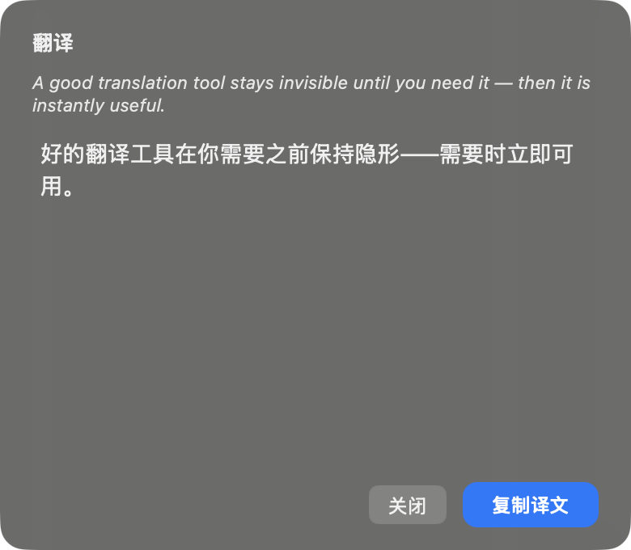</td>
<td width="50%">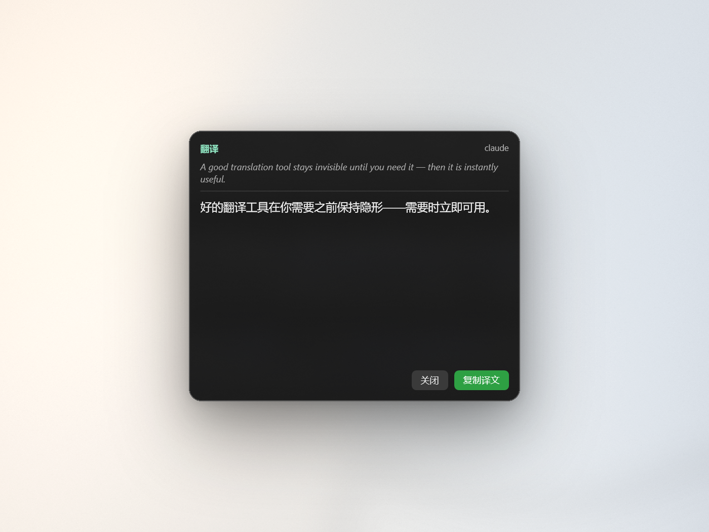</td>
</tr>
</table>

**Native on each platform, one shared contract.** Windows (WPF/.NET 9) and macOS (SwiftUI/AppKit,
Apple Silicon) ship the **same feature set** without sharing UI or runtime code — consistency is
enforced by language-neutral conformance vectors + a parity matrix + CI, not by sharing binaries
(see [Cross-platform](#cross-platform)).

| Platform | Status | Stack |
|---|---|---|
| **Windows 11** | ✅ shipped | C# / .NET 9, WPF + WinForms tray, Win32 P/Invoke |
| **macOS** (Apple Silicon, 14+) | ✅ shipped, feature-aligned with Windows | Swift, SwiftUI + AppKit, Carbon hotkeys |
| **Linux** (Ubuntu 24.04+) | ⬜ planned | tentative — see `docs/PORTING-linux.md` |

## Highlights

- **Two ways to trigger, zero context switch.** A pausable clipboard watcher (复制即翻译) plus a
  configurable global hotkey that translates whatever is on the clipboard. Default hotkey: `⇧⌘C` on
  macOS, `Shift+Alt+C` on Windows. Registration conflicts are detected and shown live in Settings.
- **A floating popup that never steals focus.** The translation appears in a glass card at the
  top-centre of your screen (macOS non-activating `NSPanel` / Windows `WS_EX_NOACTIVATE`), so your
  current app keeps focus and keystrokes. Source (italic) above translation (bold), with **复制译文
  (Copy)** / **关闭 (Close)**. It stays open while hovered, auto-dismisses on a timer you set, and you
  can **drag the card** to reposition it for the session.
- **Adaptive size + history.** Long source text gets a larger card automatically. **◀ ▶** pages back
  through your last 5 translations (e.g. `2 / 3`) without re-running them.
- **Pluggable backends behind one declarative manifest** (`spec/backends.json`), in three families:
  - **Agent CLIs** you're already logged into — `claude`, `codex`, `copilot`, `agy` (Google
    Antigravity, falls back to `gemini`), `opencode`, `kimi`, `mimo`. No extra API key.
  - **Translation / LLM HTTP APIs** (bring your own key) — `google-v2` (Google Cloud Translation v2)
    and `doubao` (火山方舟), plus a generic **OpenAI- / Anthropic-protocol HTTP** backend that ships
    with ready-to-fill DeepSeek / MiMo / Kimi presets.
  - **Custom providers** — point the generic HTTP backend at *any* OpenAI-compatible
    (`/chat/completions`) or Anthropic-compatible (`/messages`) endpoint from Settings with a base
    URL + key + a protocol toggle; delete it again when you're done.
- **Built-in backend doctor.** A one-click **检测** probe runs a non-interactive auth/connectivity
  check and lights a status lamp (checking / OK / fail), so you can confirm a CLI is logged in or a
  key works before you rely on it.
- **Editable model + per-vendor reasoning tiers.** Pick or type a model (with a live `/models` fetch
  where the backend supports it), choose a target language, and set reasoning-effort tiers for the
  CLIs that expose them.
- **Recent-translation cache.** The last 5 successful translations are cached (key = text + backend +
  model), so repeating an identical translation returns instantly instead of re-calling the model.
- **Light + dark, localized UI.** Settings and popup follow the system appearance; UI ships in
  Simplified Chinese.

> Your config and secrets stay local: settings live in `~/.translatethedamn/config.json`
> (`%USERPROFILE%\.translatethedamn\config.json` on Windows); API keys are stored only in that file
> — never committed.

## Install & run

**macOS** (Apple Silicon, Xcode 16 / Swift 6 command-line tools):

```bash
./platforms/macos/scripts/build-app.sh        # → platforms/macos/TranslateTheDamn.app
open platforms/macos/TranslateTheDamn.app
```

**Windows 11** (.NET 9 Desktop SDK/runtime):

```powershell
dotnet build platforms\windows\TranslateTheDamn.sln -c Release
.\platforms\windows\src\TranslateTheDamn.App\bin\Release\net9.0-windows\TranslateTheDamn.exe
```

Prebuilt artifacts are attached to each [GitHub Release](https://github.com/surebeli/translate-the-damn/releases)
(the macOS build is **unsigned** — right-click → Open, or
`xattr -dr com.apple.quarantine /path/to/TranslateTheDamn.app`).

There is **no main window** — look in the menu bar (macOS) / system tray (Windows) for the icon
(green = listening, grey = paused); click it for Settings or quit. On macOS the app intentionally
does **not** run in the App Sandbox (it must spawn your CLIs); for distribution, sign + notarize with
`platforms/macos/scripts/sign-notarize.sh`.

## Usage

On first launch the app writes `~/.translatethedamn/config.json` with sensible defaults. After that,
the Settings window and that file are the source of truth — everything hot-reloads, no restart needed.

<table>
<tr><td align="center"><b>macOS</b></td><td align="center"><b>Windows</b></td></tr>
<tr>
<td width="50%">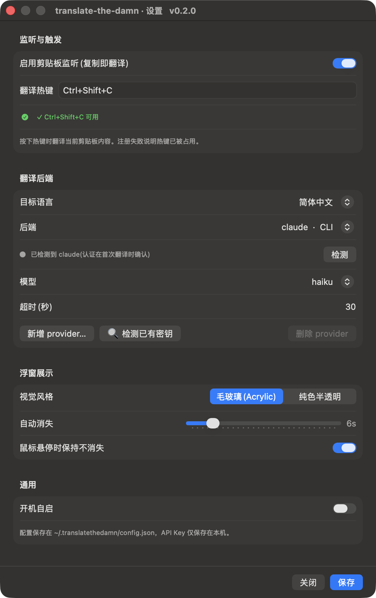</td>
<td width="50%">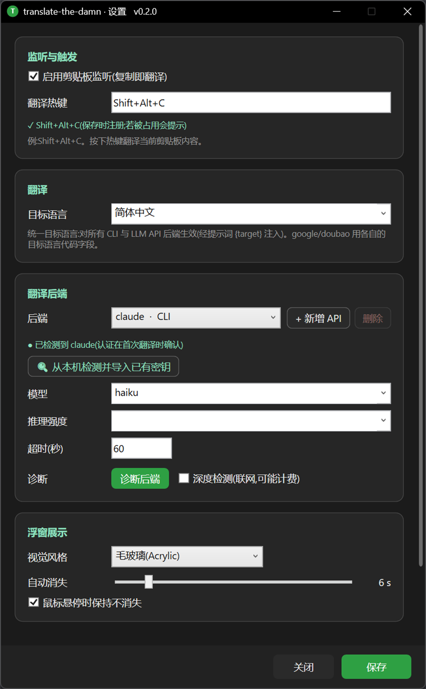</td>
</tr>
</table>

- **监听与触发 (Listen & trigger)** — toggle the clipboard watcher and set the **translate hotkey**; a
  live check confirms it's available (✓ green) or already taken.
- **翻译后端 (Translation backend)** — pick a target language and a backend (e.g. `claude · CLI`), then
  choose or type a model. Default: `claude` / `haiku`.
- **浮窗展示 (Popup)** — visual style (毛玻璃 Acrylic / solid), auto-dismiss time, keep-open-while-hovering.
- **通用 (General)** — launch at login; a footer reminds you config + API keys stay on your machine.

**Translate:** copy text (or just copy, with the watcher on), or press the hotkey. A spinner shows
while the backend runs, then the glass card slides in without stealing focus — **复制译文** to copy,
**关闭** to dismiss, hover to keep it open. Page your last 5 with **◀ ▶**; long source auto-enlarges.

<table>
<tr><td align="center" colspan="2"><b>Translating</b></td><td align="center" colspan="2"><b>History ◀ ▶</b></td></tr>
<tr><td align="center">macOS</td><td align="center">Windows</td><td align="center">macOS</td><td align="center">Windows</td></tr>
<tr>
<td width="25%"></td>
<td width="25%">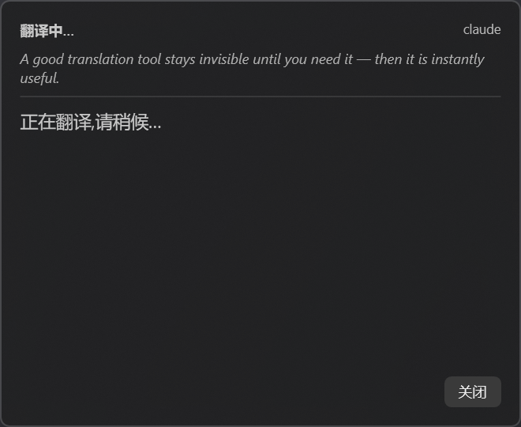</td>
<td width="25%">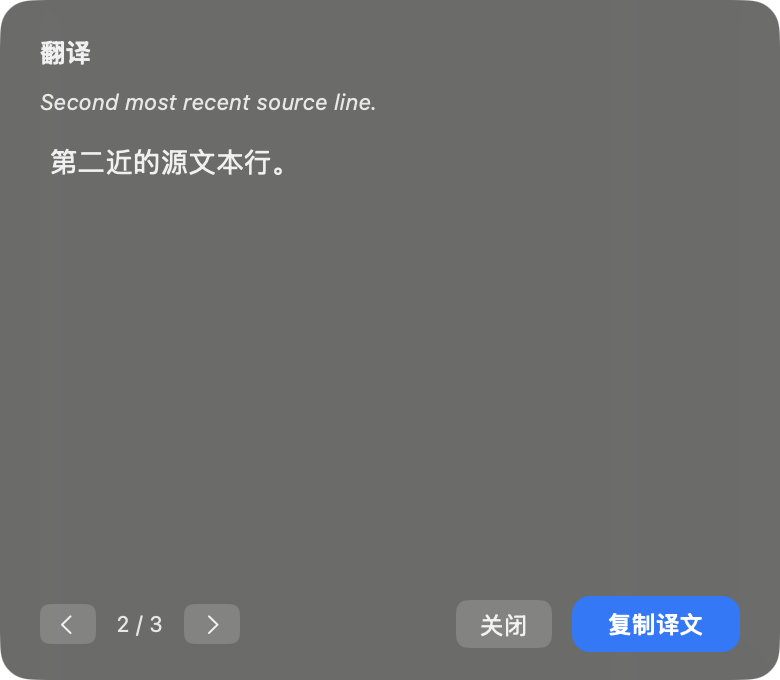</td>
<td width="25%">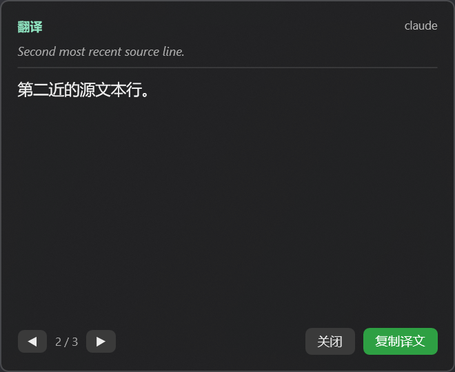</td>
</tr>
</table>

If a backend isn't logged in or the network is down, the popup shows a clear **error in red** and
points you back to the doctor in Settings:

<table>
<tr><td align="center"><b>macOS</b></td><td align="center"><b>Windows</b></td></tr>
<tr>
<td width="50%">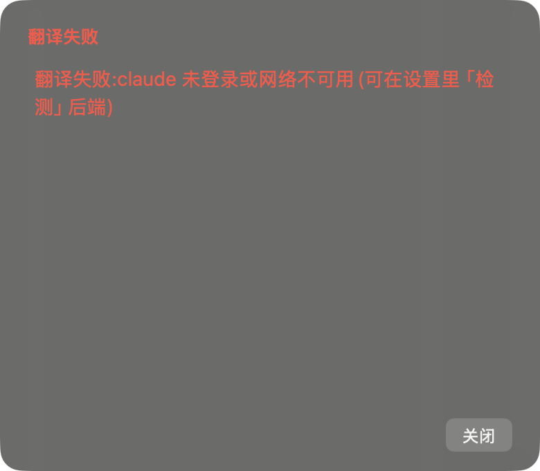</td>
<td width="50%">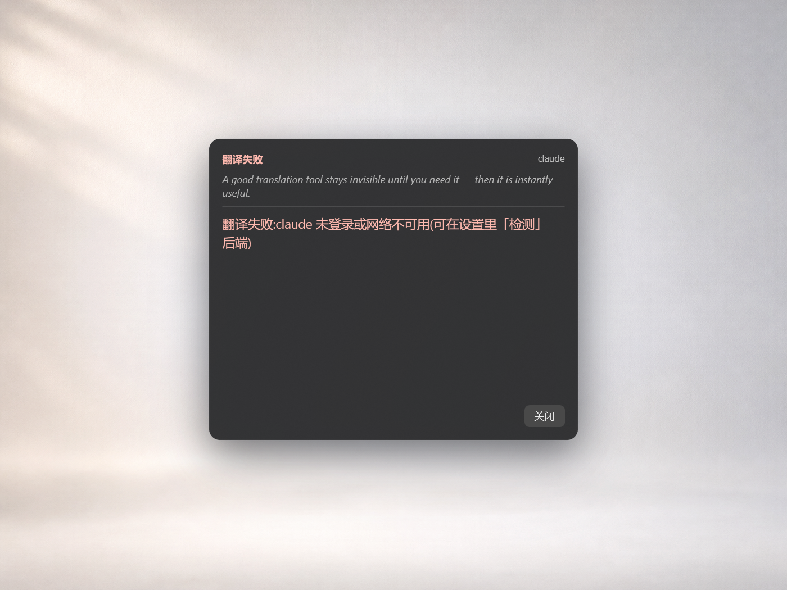</td>
</tr>
</table>

**Check a backend** with the **检测** doctor — a non-interactive auth/connectivity probe with a status
lamp (OK / fail):

<table>
<tr><td align="center"><b>macOS</b></td><td align="center"><b>Windows</b></td></tr>
<tr>
<td width="50%">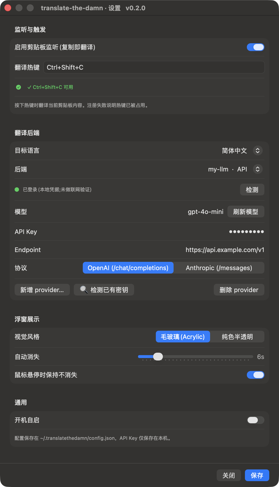</td>
<td width="50%">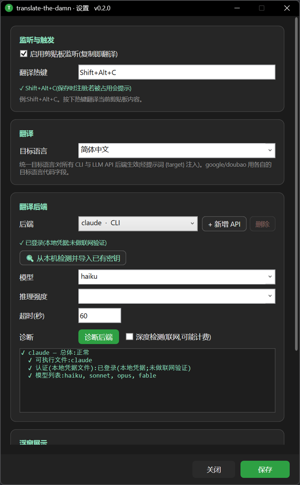</td>
</tr>
</table>

**HTTP APIs / custom providers:** select an HTTP backend (`doubao`, `google-v2`, or a DeepSeek/MiMo/Kimi
preset) and fill the masked API Key + endpoint; **检测已有密钥** can auto-discover keys already on your
machine (consent-gated, static keys only). To use any other service, **新增 provider…** with a base URL
+ key and pick **OpenAI (`/chat/completions`)** or **Anthropic (`/messages`)**:

<table>
<tr><td align="center"><b>macOS</b></td><td align="center"><b>Windows</b></td></tr>
<tr>
<td width="50%">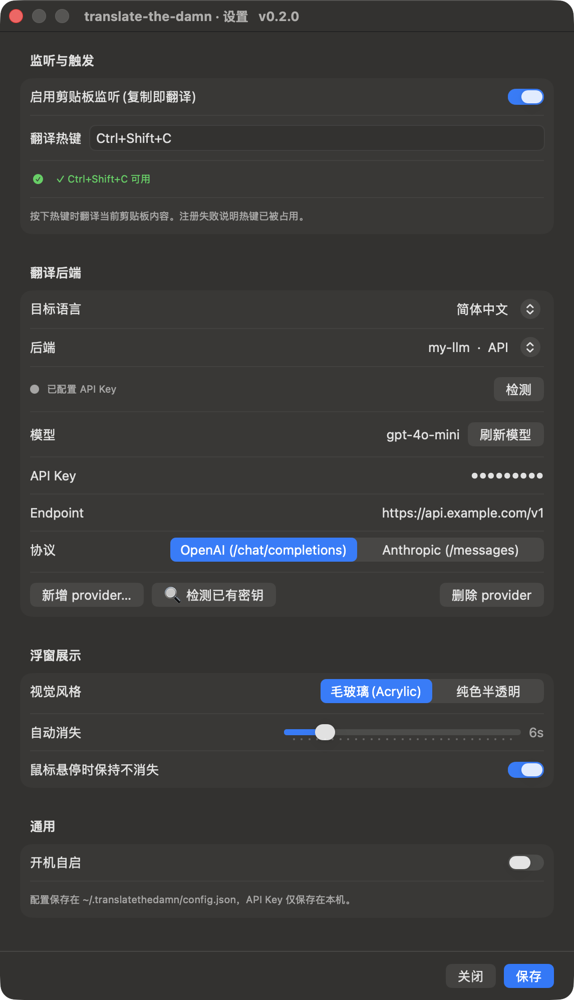</td>
<td width="50%">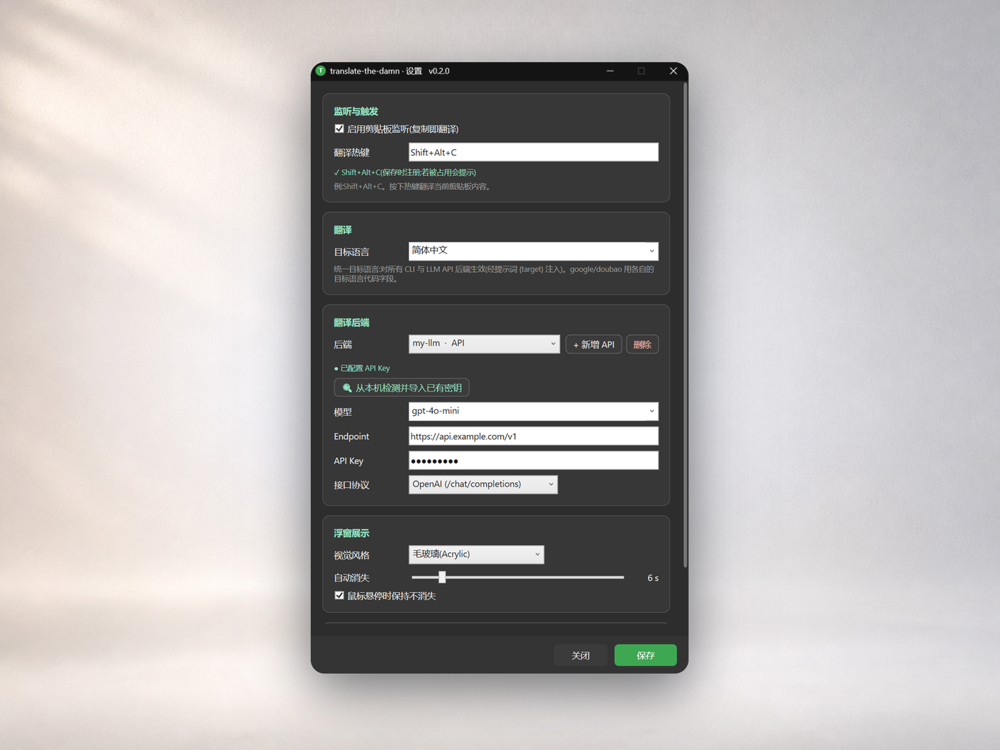</td>
</tr>
</table>

## Configuration

The translation rules are built in (`translation.promptTemplate`): English source ⇒ keep technical
terms in English, translate the rest; non-English source ⇒ translate everything; code blocks/commands
stay intact. The target language is unified via a `{target}` placeholder and selectable in Settings.
The LLM self-detects the source language.

## Backend notes

- **Agent CLIs** must be installed and **logged in**; they're heavyweight (reasoning, context) so a
  translation can take 10–30s — the **HTTP APIs are the fast path**. CLIs are spawned from a neutral
  sandbox directory (never load your current project); prompts go via stdin to avoid shell-quoting.
- **`claude` / `codex`** are verified live end-to-end on Windows; **`google-v2` / `doubao`** and the
  HTTP LLM providers are request/parse unit-tested — fill a key to use them; **`copilot` / `agy`** are
  best-effort (token/login required; known non-interactive CLI quirks). The shared request/parse,
  cache, hotkey, config, effort-tier and doctor logic is pinned by the conformance vectors and runs
  green on both Windows and macOS in CI (the vectors are offline — live CLI/HTTP calls are not
  exercised in CI).

## Cross-platform

This repo is governed by **[CONSTITUTION.md](./CONSTITUTION.md)** — the single entry point and pointer
map. The laws: change shared behaviour in `/spec` + `/conformance` **first**; the language-neutral
vectors in `conformance/` are the only source of truth for shared logic; the same `MAJOR.MINOR` means
the same feature set on every platform, tracked in **[PARITY.md](./PARITY.md)**.

Those vectors run in **CI on every push/PR** via each platform's native runner over the *same* JSON —
Windows `dotnet run`, macOS `swift test` (`.github/workflows/conformance.yml`). The pipeline also
guards against parity drift: a **coupling gate** fails a PR that changes `platforms/<os>/src/**`
without touching `PARITY.md`; **`parity-verify`** cross-checks each platform's real vector results
against its PARITY column; **`parity-evidence`** requires every ✅ UI row to point at real source.
Backends are declared once in `spec/backends.json`; macOS reads that manifest via a generic
interpreter (Constitution Law 6) and the Windows adapters are mid-refactor to do the same. How drift
is auto-surfaced and how to align a feature across platforms is in
**[docs/CROSS-PLATFORM-PARITY.md](./docs/CROSS-PLATFORM-PARITY.md)**.

## Development

```powershell
# Windows — offline conformance + unit suite (dependency-free, no network/processes)
dotnet run --project platforms\windows\tests\TranslateTheDamn.Tests
```

```bash
# macOS — conformance + unit suite
( cd platforms/macos && swift test )

# cross-platform drift report (Python stdlib, no deps)
python3 scripts/parity-drift.py
```

The Windows solution is dependency-free (framework-only: WPF + WinForms + JSON/HTTP + P/Invoke); the
macOS package is Foundation/AppKit only. Both split `Core` (platform-agnostic, vector-tested logic)
from `App` (native UI). Contributions follow a spec-first flow — see
**[CONTRIBUTING.md](./CONTRIBUTING.md)**. Design spec:
`docs/superpowers/specs/2026-06-17-translate-the-damn-design.md`.
