# translate-the-damn · macOS UI 风格评审

> 截屏与评审日期：2026-06-19 · 平台：macOS（Swift / SwiftUI + AppKit）
> 评判标准固定为 **当代 macOS 应用设计标准**（macOS 14/15 Sonoma/Sequoia HIG）：原生 `Form`/`Section`
> 分组、System Settings 风格的信息层级、SF Pro + 系统语义色、原生控件、`NSVisualEffectView` 磨砂材质（不用
> 硬编码色 / darkScrim）、主操作按钮置于右下且渲染为强调态、留白克制、明暗模式均保证对比度。

---

## 0. 现状：已实现 7 种 UI 风格

以 **O48** 为锚点（`config.general.uiStyle` 缺省即 `O48`，是当前默认值）。每种风格都同时提供**设置窗口**与**翻译浮窗**两套界面，通过同一协议共存（`{Component}UI`），由 `uiStyle` 多路 switch 选择。

| # | 代号 | 名称 | 设置窗口形态 | 浮窗气质 |
|---|---|---|---|---|
| 1 | `classic` | Classic（经典） | 自绘 `CardView` 卡片堆叠 | 最早实现，磨砂较重 |
| 2 | `ZP` | ZP（磨砂） | 原生 `Form`+`Section` 单页 | `.popover` 磨砂卡片 |
| 3 | `km` | KM（侧栏） | `NavigationSplitView` 侧栏 + 详情 | 顶部 accent 细线 + 紧凑 |
| 4 | `O48` | **O48（聚焦，默认/锚点）** | 分页 `TabView`（4 标签页） | 聚焦 HUD（深色磨砂） |
| 5 | `Z` | Z（文档卡） | 分组 `Form` + 顶部实时预览 hero | 文档卡：状态药丸 + 字数 |
| 6 | `MM` | MM（简洁磨砂） | 单页 grouped `Form` | 简洁 `.popover` 卡片 |
| 7 | `DS` | DS（清晰玻璃 + 斜体原文） | 单页 grouped `Form` + 顶部风格指示条 | 干净无强调线 + 斜体原文 |

---

## 1. 改动：设置页「界面风格」切换器 segmented → 下拉菜单

**问题**：风格已增至 7 种，而 7 个设置页此前都用 `Picker(...).pickerStyle(.segmented)` 横向平铺所有选项。
segmented 控件在 7 段时已经挤到无法阅读（每段只剩两三个字、甚至截断），不符合当代 mac 控件用法
（HIG 建议 segmented 仅用于 2–5 个等权选项，更多选项应使用下拉菜单 `Picker`/弹出按钮）。

**改动**：把全部 7 个设置页的「界面风格」选择器统一改为 `.pickerStyle(.menu)`（原生下拉菜单/弹出按钮）。
选项不变、保存逻辑不变、非法值兜底逻辑不变；只换了呈现方式。涉及文件：

```
platforms/macos/src/App/SettingsWindow.swift   (Classic SettingsView)
platforms/macos/src/App/ZPSettingsView.swift
platforms/macos/src/App/KMSettingsView.swift
platforms/macos/src/App/O48SettingsView.swift
platforms/macos/src/App/ZSettingsView.swift
platforms/macos/src/App/MMSettingsView.swift
platforms/macos/src/App/DSSettingsView.swift
```

改动后效果（以 MM 设置页「通用」区为例，最下方「界面风格」已变为 `MM（简洁）▾` 下拉）：

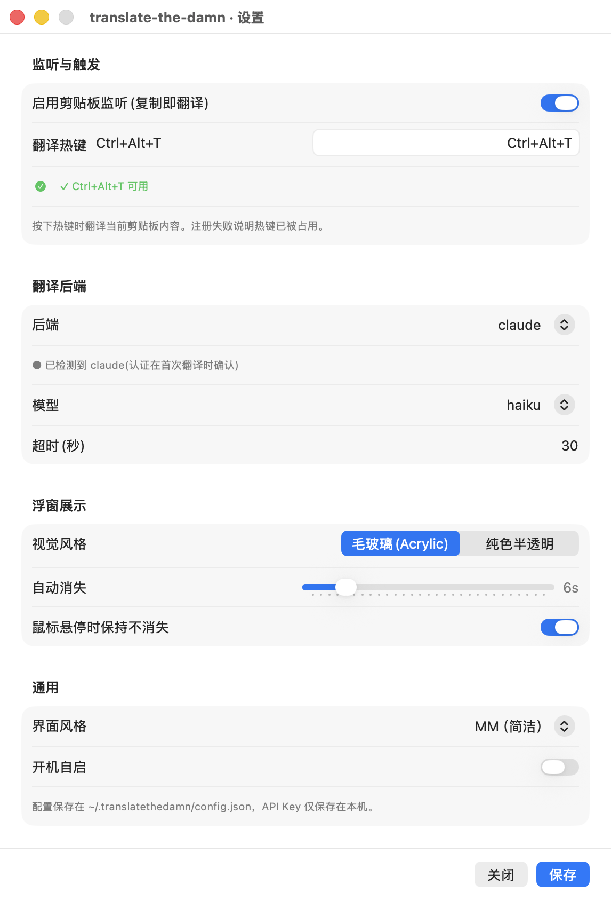

> 说明：下拉菜单天然可承载任意数量的风格，新增第 8、第 9 种风格也无需再改布局。

---

## 2. 评审方法（截屏如何生成）

为可复现且不依赖手动点击托盘菜单，新增了一个 **dev-only 截屏 harness**：

- `platforms/macos/src/App/ScreenshotHarness.swift`：仅当环境变量 `TTD_SHOT_KIND` 存在时激活（正常启动完全不走它，生产行为不变）。它按给定 `uiStyle` 渲染**一个**设置窗口或一个浮窗，把窗口号写入就绪文件，再保持存活。
- 设置窗口会被撑高到内容自然高度，以便一张图展示全部分区（真实运行时默认窗口约 560×640pt，单页表单会溢出滚动——见各风格点评）。
- 浮窗用样例文本（英文原文 + 中文译文），保留默认配置（`autoDismissSeconds=6`，截屏发生在启动后约 1.4s，远早于消失）。
- 外部用 `screencapture -l<windowNumber> -o` 抓取**真实合成窗口**（含标题栏、红绿灯、真实 vibrancy）。

全部截屏位于 `docs/ui-review/shots/`。

---

## 3. Part 1 — 各风格设置窗口点评

> 每节：截屏 → 窗口特点 → 不足（按当代 mac 标准，标注严重度 P0/P1/P2）→ 建议 → 发布/开发需强调的说明。

### 3.1 Classic（经典） — 评分 2/5

> 一个 2018 年风格的「卡片堆叠」设置 + 硬编码深色玻璃浮窗：能用、信息齐全，但几乎全部用 GroupBox+固定字号+手写颜色绕开了原生 Form/Section/语义色/强调按钮，明暗自适应与主操作层级都不达标。

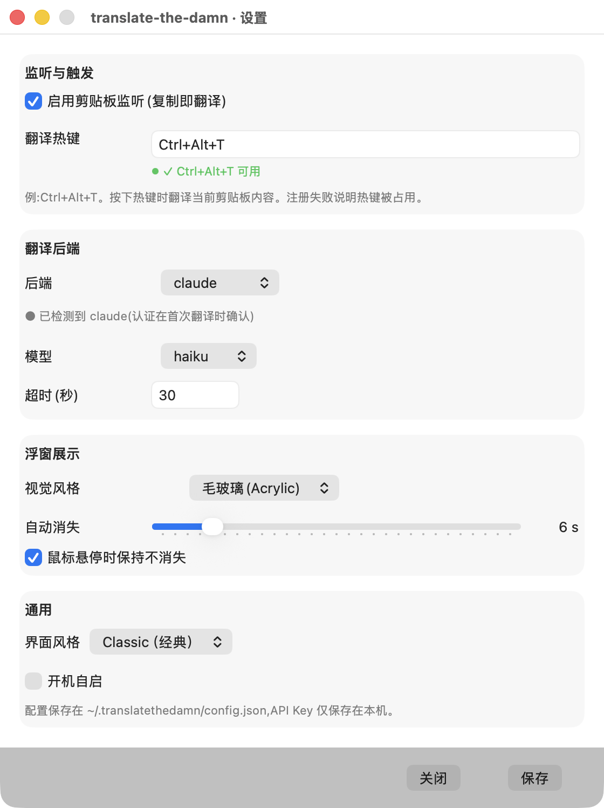

**设置窗口形态**：单页纵向滚动表单：4 个 GroupBox 卡片(监听与触发 / 翻译后端 / 浮窗展示 / 通用)堆叠在 ScrollView 内 + 底部固定操作栏(关闭/保存)

**特点**
- 用 GroupBox 包成的 CardView 做分组，每组一个 .semibold 13pt 标题，视觉上接近旧版偏好面板的『卡片堆叠』而非 System Settings 的 Form/Section
- 左侧固定 110pt 标签列 + 右侧控件的经典两栏对齐，控件统一压到 height:28，排版规整、信息密度适中
- 控件基本用原生：Toggle(.checkbox)、Picker(默认/.menu)、Slider、roundedBorder TextField/SecureField，行为正确
- 界面风格选择器已按要求改为 .menu 下拉(pickerStyle(.menu))，7 种风格不再挤 segmented，这一步是对的
- 热键校验有即时反馈(绿/红圆点 + 可用/占用/格式无效)，是超出基线的好细节
- 底部操作栏区域用 controlBackgroundColor 手动 blend 30% 黑得到一条更深的栏，与窗口主体分隔

**不足（按当代 mac 标准）**
| 严重度 | 问题 | HIG / 当代标准依据 |
|---|---|---|
| **P0** | 主操作『保存』是普通 Button(.frame(width:92)),没有 .buttonStyle(.borderedProminent),也没有设为 .keyboardShortcut(.defaultAction)。截图里『关闭』和『保存』是两个一模一样的灰按钮，用户无法一眼看出主操作，回车也不会触发保存。 | HIG Buttons：默认/主操作按钮置于右下并渲染为强调态(borderedProminent + 默认按钮态)，承接 Return 键 |
| **P1** | 整窗用 GroupBox+手写两栏(labelWidth=110)模拟分组，而非原生 Form { Section {…} } / .formStyle(.grouped)。结果是 System Settings 的标准信息层级(分区标题样式、行内分隔线、标签右对齐、行高)全部对不上，看起来像 macOS 12 之前的旧偏好面板。 | Sonoma/Sequoia 设置窗口 HIG：用 Form + Section(.grouped) 构建设置层级，由系统提供分区标题、行分隔与对齐 |
| **P1** | 底部栏背景用 NSColor.controlBackgroundColor.blended(withFraction:0.3, of:.black) 硬算出一条偏深的色，而不是用系统材质/分隔。在浅色模式下这是一条灰栏，深色模式下 blend 黑会进一步压暗，两种模式都不是系统会给出的工具栏/底栏外观，且对比度不可控。 | 材质与语义色：分区/底栏应使用 NSVisualEffectView 材质或系统分隔，不应对语义色做硬编码混色 |
| **P1** | 全部文本用 .font(.system(size: 13/11)) 固定磅值，未用 .body/.callout/.headline/.footnote 等文本样式。不响应『辅助功能-更大文本』，且与系统设置的字号层级不一致。 | Typography：使用系统文本样式(Dynamic Type-aware)而非硬编码 pt |
| **P1** | 窗口 styleMask 仅 [.titled,.closable,.miniaturizable] 且 SwiftUI 根视图 .frame(width:560) 固定宽度、不可缩放；内容靠 ScrollView 溢出滚动(背景已知默认 ~560×640 会滚动)。System Settings 类窗口通常按内容自适应高度或可缩放，固定宽+滚动让一个本应一屏的设置页显得局促。 | 窗口尺寸：设置窗口应按内容自适应/允许缩放，避免主要设置被迫滚动 |
| **P2** | 状态点用 Circle().fill(.red/.green) 与字面 ✓/✗ 字符表达校验结果，纯靠颜色+符号传达对错，未用系统语义(如 .green 应为 controlAccent/系统绿)且对色盲不友好；‘已检测到/未配置’也用 ● 字符前缀。 | 颜色无障碍：不要仅靠颜色传达状态；优先 SF Symbols + 系统语义色 |
| **P2** | 保存反馈是把『已保存 ✓』塞进底栏左侧的一段文本，无淡入淡出/无自动消隐逻辑，属于临时提示却常驻；不是 macOS 常见的内联确认方式。 | 反馈：瞬时状态宜短暂呈现，避免长期占据操作栏布局 |
| **P2** | Picker 多处用 Picker("", ...) 空 label + 手写 Text 标签列，破坏了控件与标签的可访问性关联(VoiceOver 读不到字段名)。 | 无障碍：控件应有有效的可访问标签，避免空 label + 视觉伪标签 |

**建议**
- 改用 Form { Section("监听与触发") {…} } + .formStyle(.grouped)，删掉 CardView/GroupBox 与手写 labelWidth，让系统接管分区标题、行分隔与标签对齐。
- 保存按钮加 .buttonStyle(.borderedProminent) + .keyboardShortcut(.defaultAction)；关闭用 .keyboardShortcut(.cancelAction)。底栏右下，主操作在右。
- 去掉 blended(of:.black) 的底栏背景，改用默认 Form 的 footer 区域或 .bar 材质;若保留底栏用 .background(.bar) 或 NSVisualEffectView。
- 把所有 .font(.system(size:)) 换成文本样式(.body/.callout/.footnote 等)，让字体随系统/辅助功能缩放。
- 窗口允许缩放(加 .resizable)或对内容用 .fixedSize 让高度自适应，避免一屏设置被迫滚动;给一个合理 minHeight。
- 校验/检测状态改用 Label + SF Symbol(checkmark.circle.fill / exclamationmark.triangle.fill) + 系统语义色，并给 Picker/TextField 真实 label(可用 LabeledContent)。

**发布 / 开发需强调或补充的说明**
- 发布前必须在浅色与深色两种系统外观下分别截图验收：当前底栏 blend 黑、状态绿/红均为硬编码，浅色模式下对比度与观感未验证。
- 验收项:Save 必须是 borderedProminent 强调态且回车可触发，Close 响应 Esc;Tab 焦点顺序覆盖所有字段(键盘可达性)。
- 真实默认窗口 ~560×640 会触发滚动，需在最小窗口尺寸下确认所有分区可读、操作栏不被裁切;若改自适应需回归各后端(claude/codex/agy/google-v2/doubao)字段增减后的高度。
- Picker("") 空 label 需补可访问标签，发布前过一遍 VoiceOver 朗读字段名。
- 界面风格已是 7 项 .menu 下拉，确认下拉项顺序/文案与各风格 tag 一一对应，且选中后切换风格的窗口重建路径(SettingsWindowController.show 的 switch)正常。

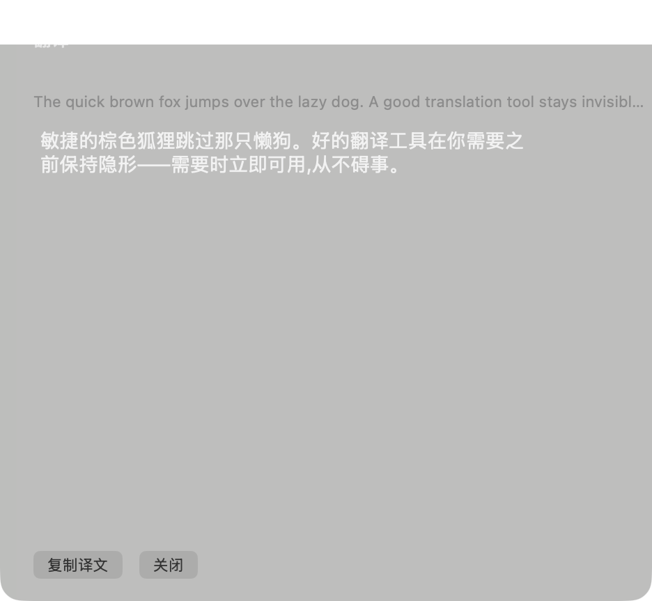

**浮窗特点**
- NSPanel(nonactivatingPanel + floating)做无边框浮窗，顶部居中弹出，圆角 12，有阴影，淡入淡出 0.2s，符合『不抢焦点的浮层』定位
- 确实用了 NSVisualEffectView(material:.popover, blendingMode:.behindWindow, state:.active)，底层有真实毛玻璃材质
- 结构清晰:标题(翻译) + 原文(单行/2 行截断) + 可滚动可选中的译文(NSTextView) + 复制译文/关闭按钮
- 译文用 NSTextView 可选中、可滚动，长文有垂直滚动条且自动隐藏，复制按钮有『已复制 ✓』瞬时反馈(1.5s 回退)
- 窗口宽 468、高按内容计算并夹到屏幕可视高度 60%，离屏顶 24pt，定位逻辑稳妥

**浮窗不足**
| 严重度 | 问题 | HIG / 当代标准依据 |
|---|---|---|
| **P0** | 在 .popover 系统材质之上又叠了一层硬编码 darkScrim(NSColor(white:0, alpha:0.15)),并把 header/body/source/译文 全部设成硬编码近白色(white:0.9 / 0.7 / 0.55 / 0.95)。这等于强制把浮窗钉死成『深色玻璃』，完全绕过了系统材质对浅色/深色外观的自适应。截图里就是一块灰黑玻璃。 | 材质与语义色:用 NSVisualEffectView 材质表达半透明，文本用 labelColor/secondaryLabelColor 让系统按外观给对比度;禁止 darkScrim + 硬编码白字 |
| **P0** | 在浅色桌面/浅色外观下，白底毛玻璃 + 近白色文字(white:0.9 的标题、white:0.55 的原文)会严重低对比甚至不可读。当前实现里没有任何随外观切换文字颜色的逻辑(颜色是写死的)。 | 对比度:正文/标题在明暗模式均需达到可读对比，应交由 labelColor 系列语义色处理 |
| **P1** | 复制译文/关闭两个按钮都是 bezelStyle:.rounded、controlSize:.small、无强调态。截图里两枚按钮完全等权，没有主操作(复制)的视觉突出，也没有默认按钮态/键盘快捷键。 | Buttons:主操作应为强调态(.borderedProminent/keyEquivalent),次操作普通态 |
| **P1** | 译文文本框对暗外观用 usesAdaptiveColorMappingForDarkAppearance=true 但又显式 textColor=white:0.95 覆盖，两套机制打架;且 error 态用硬编码淡红(1.0,0.71,0.66)，同样不随外观变。 | 语义色:错误用 systemRed/secondaryLabel 等语义色，避免硬编码 RGB |
| **P2** | 原文 sourceLabel 限 2 行 byTruncatingTail，截图里长英文原文被一行省略号截断(…invisibl…)，用户看不到完整原文;译文区却占大片空白。原文/译文的空间分配不合理。 | 内容呈现:关键内容不应被过早截断;留白应服务内容而非浪费 |
| **P2** | 按钮区位于浮窗左下角(buttonStack 左对齐),而 mac 浮层/对话的主操作惯例在右下;且整窗大量竖向空白(译文短时仍撑到固定 scroll 高度)未利用。 | 布局:主操作通常右下;窗口高度宜随内容收紧，避免空状态大面积留白 |

**浮窗建议**
- 删除 darkScrim 与所有 NSColor(white:…) 硬编码文本色:标题用 labelColor、原文/说明用 secondaryLabelColor/tertiaryLabelColor、译文用 labelColor，让 .popover 材质自行适配明暗。
- 材质若想更通透可换 .hudWindow 或保持 .popover，但不要再叠半透明黑;错误文案用 NSColor.systemRed。
- 复制译文设为强调态(borderedProminent 或 keyEquivalent=\r),关闭设为次级;按钮组右对齐(buttonStack 前加 spacer 或 leading spacer)。
- 原文允许更多行或可展开/滚动，按内容收紧窗口高度;短译文时不要硬撑 300/400 的 scroll 高度。
- 移除与硬编码 textColor 冲突的 usesAdaptiveColorMappingForDarkAppearance，统一走语义色一条路径。

**浮窗发布 / 开发需强调的说明**
- 发布前必须在『浅色桌面/浅色外观』与『深色外观』下各实测一次浮窗:当前文字与 scrim 全硬编码，浅色下极可能低对比/不可读，这是阻断项。
- 验收:复制按钮为强调态且有键盘快捷键，关闭可被 Esc 触发;长原文/长译文与超短译文三种内容下分别确认截断、滚动、窗口高度自适应表现。
- 确认 popup.style=solid(纯色半透明)与 acrylic 两种设置在两种外观下都通过对比度,且 solid 不是又一处硬编码深色。
- 浮窗不抢焦点(canBecomeKey=false)前提下，验证 NSTextView 仍可被选中复制、复制按钮点击在 nonactivatingPanel 下可用。
- 原文一行省略号截断是产品决策点:若要展示完整原文需联动 preferredContentHeight 高度计算，发布前与设计确认原文/译文空间分配。

---

### 3.2 ZP（磨砂） — 评分 4/5

> 设置页是教科书级的原生 Form/Section + 强调态主按钮，最贴合当代 macOS；浮窗材质与语义色到位，但主操作未强调、窗口尺寸不自适应（短文留白）是两处明显待修点。

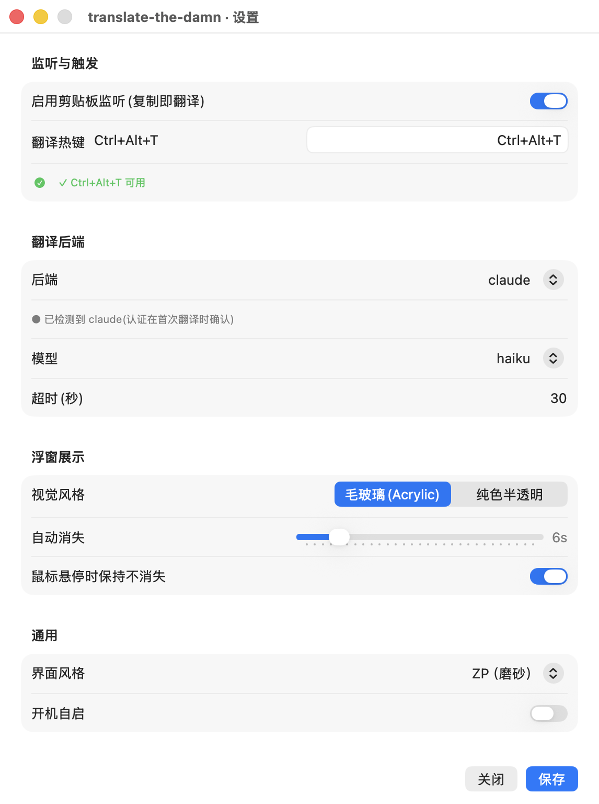

**设置窗口形态**：单页分组表单（SwiftUI Form .grouped + 多个 Section），底部固定一条非滚动的操作栏

**特点**
- 真正使用原生 SwiftUI Form + Section 分组，且 .formStyle(.grouped) 直出 System Settings 风格的分组卡与行内标签布局，信息层级与系统设置一致
- 控件全部原生：Toggle 开关、Picker（segmented 用于二选一视觉风格、menu 用于 7 种界面风格）、Slider、.roundedBorder TextField，无自绘控件
- 主操作「保存」用 .borderedProminent 渲染为强调态并置于右下，「关闭」为普通按钮，符合 macOS 主/次按钮约定（截图中蓝色强调按钮在右下角）
- 底部操作栏放在 Form 之外的独立 HStack，因此内容滚动时按钮始终钉在底部，符合 sheet/settings 的操作区固定惯例
- 颜色全部走语义色（.secondary / .red / .green / labelColor），热键状态用 SF Symbols Label + 语义色表达，明暗模式自适应
- 留白节制不浪费：行高、分组间距由系统 grouped 样式控制，整体接近原生设置面板观感

**不足（按当代 mac 标准）**
| 严重度 | 问题 | HIG / 当代标准依据 |
|---|---|---|
| **P1** | 窗口只设了 .frame(minWidth: 480)，没有给高度上下界，也没有显式滚动容器策略。已知真实默认窗口约 560×640，单页四个分组会溢出并触发 Form 内部滚动——这意味着首屏可能看不到底部「保存」按钮，或滚动区与固定底栏的边界没有视觉分隔，用户不易察觉内容被裁切。 | System Settings 风格窗口应保证主操作可见或滚动边界清晰；macOS HIG 设置窗口要求尺寸自适应内容、关键操作（保存）不被首屏裁切 |
| **P1** | 硬编码中文/符号字面量散落在视图层（如「✗ 热键已被占用」「源语言(可选)」「目标语言」「推理强度」「回退命令」「界面风格」「毛玻璃(Acrylic)」等），未走 StringsLoader/strings 资源，违背项目 strings 契约且不利于本地化与明暗/无障碍审校。 | 项目约定 UI 字符串读 strings/zh-CN.json；HIG/本地化最佳实践要求文案集中管理 |
| **P2** | 底部操作栏与上方滚动内容之间没有任何分隔（无 Divider、无材质底板）。当 Form 内容滚动时，滚动文本会直接顶到按钮行下方，缺少系统常见的「滚动内容 / 固定操作区」分界，视觉上操作栏像是悬空贴在普通窗口背景上。 | HIG：固定底部操作区惯例上以分隔线或材质与可滚动内容区分（参考 System Settings / sheet 的 bottom bar） |
| **P2** | 两个 Picker 的样式不统一：组内「视觉风格」用 .segmented，而「界面风格」用 .menu。两者都在同一张 grouped 表单里、都是单选枚举，混用 segmented + menu 在同一页里造成控件语言不一致。segmented 这里仅 2 项尚可，但与 menu 并存削弱一致性。 | HIG 一致性原则：同类语义（单选枚举）在同一界面应使用一致的控件表现 |
| **P2** | 「保存」为显式按钮而非即时保存，且未见 .keyboardShortcut(.return)/.defaultAction，「关闭」也未绑定 .cancelAction(Esc)。当代 macOS 设置面板趋势是即时生效（无保存按钮）；若保留保存模式，主/次按钮至少应绑定 Return/Esc 键盘快达。 | HIG：现代偏好设置倾向即时应用；保留确认按钮时主按钮应为默认按钮（Return），取消绑定 Esc，保证键盘可达性 |

**建议**
- 给窗口设定合理的 idealHeight 并让 Form 在内容超高时滚动、低于阈值时自适应收缩；同时确保首屏能看到底部「保存」按钮（或改为即时保存去掉按钮）。
- 在底部操作栏上方加一条 Divider 或将其放入带 .bar 材质的容器，明确滚动区与固定操作区边界。
- 统一两个枚举 Picker 的控件样式（同一页内都用 .menu，或都用紧凑 Picker），避免 segmented 与 menu 混用。
- 为「保存」加 .keyboardShortcut(.defaultAction)（Return）、为「关闭」加 .cancelAction（Esc），补齐键盘可达性；并考虑改为即时保存以贴近当代设置面板。
- 把视图层所有中文/提示字面量收敛到 StringsLoader / strings 资源，移除硬编码文案。
- 「自动消失」Slider 行可补充最小/最大值的端点标签或当前值的可访问性标注，方便 VoiceOver 与精确取值。

**发布 / 开发需强调或补充的说明**
- 必须在真实默认尺寸（约 560×640）下回归：确认四个分组滚动时底部「保存/关闭」始终可见且可点，不被裁切。
- 验收主按钮确为强调态（controlAccentColor），并在浅色/深色及自定义强调色下各截一张确认。
- 验证键盘可达：Tab 焦点顺序、Return 触发保存、Esc 关闭；VoiceOver 朗读各 Section 标题与控件标签。
- 所有界面文案改为走 strings 资源后需跑一遍本地化 lint，确认无遗漏硬编码字符串。
- 切换「界面风格」.menu 下拉后需确认 7 个选项标签与实际样式 key 一一对应（DS/Z/km/ZP/classic/O48/MM 的 tag 值大小写易错）。

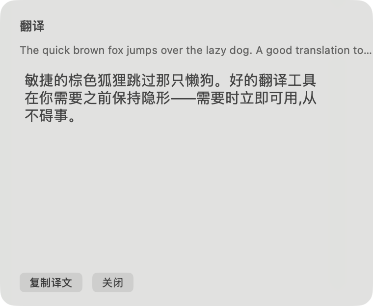

**浮窗特点**
- 使用真正的 NSVisualEffectView 磨砂材质：acrylic 用 .popover material + .behindWindow + .active state，solid 用 .contentBackground + .inactive，没有 darkScrim/硬编码底色，背景透出真实毛玻璃
- 12pt 圆角 + 系统阴影 + 无标题栏的 .nonactivatingPanel（canBecomeKey/Main=false，.floating 级别），不抢焦点，符合浮窗惯例
- 字体与颜色全部语义化：headerLabel semibold 13、source 11 secondaryLabel、译文 15 labelColor、错误态 systemOrange、loading 态 tertiaryLabel；并开启 usesAdaptiveColorMappingForDarkAppearance，明暗自适应
- 信息层级清晰：标题「翻译」/ 斜体灰原文（截断 2 行）/ 大字号醒目译文 / 底部按钮，译文可选中复制、可滚动
- 出现/消失有 0.2s 透明度动画，顶部居中定位，悬停可暂停自动消失（NSTrackingArea）

**浮窗不足**
| 严重度 | 问题 | HIG / 当代标准依据 |
|---|---|---|
| **P1** | 主操作「复制译文」没有任何强调态——与「关闭」同为 .rounded / .small 灰色按钮，没有 .borderedProminent/accent，也没有默认按钮（Return）treatment。截图中两个按钮视觉完全平级，用户无法一眼识别主操作。当代 macOS 主操作应渲染为强调态。 | HIG 按钮：主操作应使用 prominent/accent 强调态，与次要操作形成视觉区分 |
| **P1** | 窗口尺寸硬编码为 380×200、内部滚动区固定 320×200，浮窗不随译文长度自适应。短译文（如截图）下译文与按钮之间留出大片空白，浮窗显得空旷失衡；同时固定 320 宽未随更长原文/译文调整，长内容只能滚动。 | HIG：信息类浮窗应自适应内容尺寸，避免大面积空状态留白或不必要的内部滚动 |
| **P2** | 底部按钮左对齐（bottom-left），而非 macOS 惯用的主操作置于右下。对非模态信息浮窗左对齐尚可接受，但叠加主按钮无强调态，整体操作区缺乏「这是主行动」的引导。 | HIG：确认/主操作惯例置于右下并强调；至少应在视觉上明确主操作位置 |
| **P2** | acrylic 用 .popover material 透出桌面背景，虽用语义色保证理论对比度，但在高饱和/亮色壁纸下 secondaryLabel 的原文行与 tertiaryLabel 的 loading 文案对比度可能不足，缺少实测验证（代码注释自称无对比问题，属未验证假设）。 | HIG 无障碍：文本与磨砂背景需满足最低对比度（WCAG/系统标准），尤其透出彩色壁纸时 |
| **P2** | 原文行固定 maximumNumberOfLines=2 且 byTruncatingTail，长原文被截断为「…」，用户无法查看完整原文（仅 truncate 到 400 字符再交给 2 行截断）。对翻译工具而言原文可读性受限。 | HIG：避免在主要信息上做不可恢复的截断，或提供展开/悬停查看完整内容的途径 |

**浮窗建议**
- 将「复制译文」改为 .borderedProminent 或 NSButton .push + accent，并设为默认按钮（keyEquivalent=\r）；「关闭」保持普通按钮，形成主/次区分。
- 让浮窗按内容自适应高度（短文不留大片空白、长文增长到上限再滚动），并考虑宽度对长内容的弹性；移除短译文下的空旷感。
- 按钮区改为右对齐或主操作置右下（至少在视觉上突出主操作），与系统对话框/浮窗惯例一致。
- 对原文行允许悬停/点击展开完整原文，或增加行数上限，避免长原文被「…」吞掉。
- 对 acrylic 材质在浅色/深色 + 高饱和壁纸下实测原文(secondaryLabel)与 loading(tertiaryLabel)对比度，必要时在文本下加轻微材质衬底或改用更稳的材质（如 .hudWindow）。

**浮窗发布 / 开发需强调的说明**
- 必须在浅色与深色桌面、且分别叠加纯色/高饱和/亮色壁纸下实测浮窗文本对比度（标题、原文、译文、loading、错误态五种），代码注释的「无对比问题」需用实截图证伪/证实。
- 验收主操作「复制译文」确实渲染为强调态且 Return 可触发，「关闭」可被 Esc 或点击关闭。
- 回归不同译文长度：极短（一两个字）、中等、超长（触发滚动）三种，确认浮窗高度自适应、无大面积空状态、滚动条按需出现。
- 确认 .nonactivatingPanel 行为：弹出不抢前台焦点、不打断用户当前输入；多屏/外接屏下顶部居中定位正确（当前固定取 NSScreen.screens.first，需验证非主屏场景）。
- 验证 acrylic 与 solid 两种风格切换后材质/state 正确，且 solid 在浮窗叠加深色内容时仍不透明可读。

---

### 3.3 KM（侧栏） — 评分 4/5

> KM 是七种风格里最贴近原生 System Settings 架构的一版（侧栏 + 分组 Form + 全原生控件），设置窗几乎可直接发布；扣分主要在浮窗手绘强调按钮的对比度/控件一致性，以及侧栏窗口在短内容下的留白浪费与持久保存栏这一与现代设置范式相悖的设计。

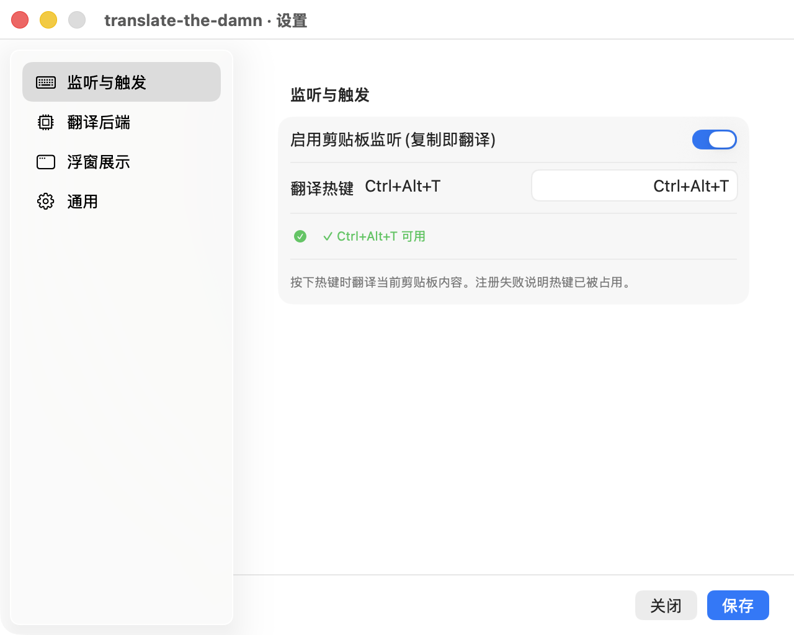

**设置窗口形态**：侧栏 NavigationSplitView（左 4 类目 List+SF Symbols，右分组 Form）+ 持久底部保存栏

**特点**
- 真正的 System Settings 架构：NavigationSplitView 左侧 List(selection:) + Label(systemImage:)，右侧按类目切换 .formStyle(.grouped) 的 Form/Section，信息层级与系统设置一致
- 控件全部原生：Toggle 开关、Picker、Slider、SecureField、TextField(.roundedBorder)，未见硬编码控件样式
- 字体与颜色走系统语义：标题/正文用默认 SF，辅助说明用 .font(.caption)+.foregroundStyle(.secondary)，热键状态用 .red/.green 语义色
- 主操作（保存）置于底部栏右下并渲染为 .borderedProminent 强调态，符合主按钮位置约定
- 侧栏分类（监听与触发/翻译后端/浮窗展示/通用）拆分清晰，每页只放一个 Section，单页不溢出（与单页 Form 风格相比反而更省滚动）

**不足（按当代 mac 标准）**
| 严重度 | 问题 | HIG / 当代标准依据 |
|---|---|---|
| **P1** | 浮窗样式选择器仍是 .pickerStyle(.segmented)（popupForm 第151行），而界面风格选择器刚改成 .menu 下拉，同一设置窗内两个等价的单选 Picker 呈现方式不一致，视觉与交互割裂 | 同窗控件一致性：System Settings 中同级单选项要么统一用 Picker(.menu) 要么统一 segmented，不应混用 |
| **P1** | 底部常驻『关闭 / 保存』保存栏是 Windows/旧式对话框范式，不符合当代 macOS 设置即改即存的心智；且『关闭』与强调态『保存』并排易让用户误以为关闭会丢弃改动 | 现代 macOS 设置窗采用即时生效（auto-apply）+ 无 OK/Cancel，System Settings 已无持久保存栏 |
| **P1** | 浮窗主按钮 KMPrimaryButton 是手绘：isBordered=false + layer 填 controlAccentColor + allowsVibrancy=false + 文字用 alternateSelectedControlTextColor。截图中『复制译文』文字偏灰、与蓝底对比度不足，且非系统控件，按下态/焦点环/灰度辅助功能模式均不受系统管理 | 强调态主按钮应使用系统控件（.borderedProminent / NSButton 默认强调），保证明暗模式与对比度由系统托管 |
| **P2** | minHeight 480 / 实际默认约 560×640，但像『监听与触发』这类只有一个短 Section 的页面，右侧 detail 区下方留出大半屏空白（截图可见），各页内容高度差异大时空窗感明显 | 窗口尺寸应与内容自适应，避免大片空白浪费（HIG: 合理留白但不浪费空间） |
| **P2** | 热键行把 vm.hotkeyDisplay 直接拼进 Text 标签（『翻译热键 Ctrl+Alt+T』），同时 TextField 内又右对齐回显同一值『Ctrl+Alt+T』，造成同一信息出现两次，且热键应优先用录制式 KeyboardShortcuts 控件而非自由文本框 | 标签不应与控件值重复展示 |
| **P2** | 浮窗里『关闭』是 controlSize=.small 的 .rounded 系统小按钮，旁边却是自绘高度22pt的强调块，两者高度/圆角/字重不统一，按钮组显得拼接 | 同一操作区控件视觉权重应协调 |
| **P2** | 顶部 3pt controlAccentColor accent rail 横贯整窗，是 KM 的品牌标识但偏装饰性；在无标题的极简卡片上略显突兀，需确认在各强调色主题下都协调 | 浮窗强调色装饰应有意义且不喧宾夺主 |

**建议**
- 把 popupForm 的样式 Picker 从 .pickerStyle(.segmented) 统一为与界面风格一致的 .menu（或两者都用 segmented），消除同窗不一致
- 重新评估持久保存栏：现代做法是即改即存、移除底部 OK/Cancel；若产品坚持显式保存，则将『保存』改为默认按钮（绑定 Return/.keyboardShortcut(.defaultAction)）并明确未保存态提示
- 让窗口高度按当前类目内容自适应，或给短内容页增加上对齐+合理 maxWidth，减少右侧大面积空白
- 热键改用录制式快捷键控件（如 KeyboardShortcuts 风格的可点击录制框），并去掉标签里重复回显的 hotkeyDisplay
- 浮窗主按钮尽量改用系统强调态控件（bezelStyle=.rounded + .keyEquivalent='\r' 或在 key 窗用 .borderedProminent）；若因 nonactivating 面板必须自绘，则文字色改用确保对比度的纯白/系统对比色并补齐按下/禁用态
- 统一浮窗按钮组视觉权重：让『关闭』与主按钮同高同圆角同字号，或将『关闭』降为无边框次级文字按钮

**发布 / 开发需强调或补充的说明**
- 发布前必须在浅色/深色桌面 + 浅色/深色外观下实测浮窗 .popover 与 .contentBackground 材质对比度，确认源文(tertiaryLabel)、译文(label)、强调按钮文字均达可读对比度
- 验证浮窗主按钮在『增强对比度』『降低透明度』『灰度』等辅助功能模式下仍清晰——自绘 layer 填色不会自动响应这些系统设置，需手动适配
- 确认强调态主按钮在不同 controlAccentColor 主题（蓝/紫/粉/橙/绿/石墨）下文字对比度都达标，accent rail 同理
- 设置窗需实测真实默认尺寸（约560×640）下各类目页的滚动与留白表现，尤其后端页字段最多、触发页字段最少的两个极端
- 全键盘可达性：侧栏 List 上下键切换、Tab 在 Form 字段间循环、Return 触发保存、Esc 关闭浮窗与窗口都需验证
- 浮窗为 nonactivatingPanel 且不抢焦点，需确认『复制译文』『关闭』可点击且复制成功后『已复制』反馈可见
- 热键文本框当前为自由输入并依赖 vm.checkHotkey 校验，发布前确认非法/占用/空值三态文案与系统冲突检测一致
- 强调态保存按钮当前未绑定键盘默认动作，若保留保存栏需补 .keyboardShortcut，否则键盘用户无法快速保存

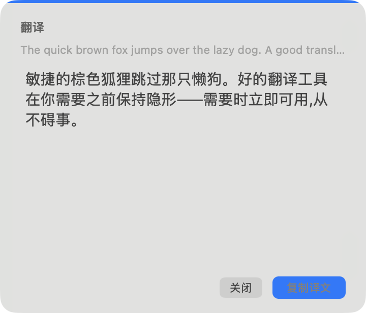

**浮窗特点**
- 真实 NSVisualEffectView 磨砂：acrylic 用 .popover 材质 state=.active，solid 用 .contentBackground state=.inactive，blendingMode=.behindWindow，无 darkScrim/硬编码底色
- 文字全用系统语义色：header=secondaryLabel、source=tertiaryLabel、译文=label、错误=systemOrange，明暗模式自动适配
- 非抢焦点浮窗：NSPanel(.nonactivatingPanel)+canBecomeKey/Main=false+.floating level，符合划词/剪贴板翻译浮窗的正确行为
- 顶部 3pt controlAccentColor accent rail 作为 KM 品牌标识，14pt 圆角卡片 + hasShadow
- 垂直节奏清晰：状态头(小字semibold) → 弱化原文(可截断) → 可滚动可选中译文(15pt) → 右对齐操作区；进出场 0.2s 淡入+轻微上移

**浮窗不足**
| 严重度 | 问题 | HIG / 当代标准依据 |
|---|---|---|
| **P1** | 主按钮 KMPrimaryButton 自绘：layer 填 controlAccentColor + 文字 alternateSelectedControlTextColor + allowsVibrancy=false。截图中『复制译文』文字偏灰、蓝底上对比度不足，且无按下/禁用/焦点态 | 强调态主按钮应使用系统控件保证对比度/状态/辅助功能由系统托管 |
| **P2** | 『关闭』是 controlSize=.small 的系统 .rounded 按钮，与右侧自绘22pt强调块在高度/圆角/字重上不统一，按钮组观感拼接 | 同一操作区控件视觉权重需协调 |
| **P2** | 自绘 accent 按钮与 vibrancy 材质均未显式处理『降低透明度』『增强对比度』，可能在这些模式下对比不足或材质失效 | 辅助功能：降低透明度/增强对比度模式下材质与自绘色需有回退 |
| **P2** | 顶部满宽 accent rail 在极简无标题卡片上偏装饰，需确认各强调色主题下不抢译文注意力 | 装饰元素不应喧宾夺主 |

**浮窗建议**
- 主按钮优先改用系统强调态控件；确需自绘则文字色改为高对比纯白/系统对比色，并补齐 highlighted/disabled 态
- 统一按钮组：『关闭』与主按钮同高同圆角同字号，或把『关闭』降为无边框次级文字按钮
- 对『降低透明度/增强对比度』提供材质与色彩回退（如切到不透明 contentBackground + 实心强调底）
- 确认 accent rail 在全部 controlAccentColor 主题下与磨砂背景协调，必要时降低其视觉权重或仅在 header 处点缀

**浮窗发布 / 开发需强调的说明**
- 浅色/深色桌面 + 浅色/深色外观四象限实测磨砂对比度，重点是 tertiaryLabel 原文与自绘强调按钮文字
- 辅助功能模式（增强对比度/降低透明度/灰度）下验证浮窗可读性——自绘 layer 填色不自动响应这些设置
- 各 controlAccentColor 主题下验证按钮文字与 accent rail 对比度
- 非抢焦点面板下确认按钮可点击、复制成功的『已复制』反馈可见、自动消失/hover 保持逻辑正确
- 确认译文超长时 scrollView 滚动正常、原文截断(400字)与省略号表现符合预期

---

### 3.4 O48（聚焦 · 当前默认/锚点） — 评分 4/5

> 设置页是干净的原生 grouped-Form 分页表单、主按钮强调态与控件全合规(扣分在顶 Tab 仍是上一代 segmented 而非侧栏、Section 与 tab 标题重复、分页高度不自适应);浮窗用真材质 + 自绘强调按钮巧妙规避了非 key 面板下强调按钮退灰的坑,识别度强,但 acrylic 钉死深色导致“关闭”次按钮对比过弱、accentRail 实际不可见是主要待修点。

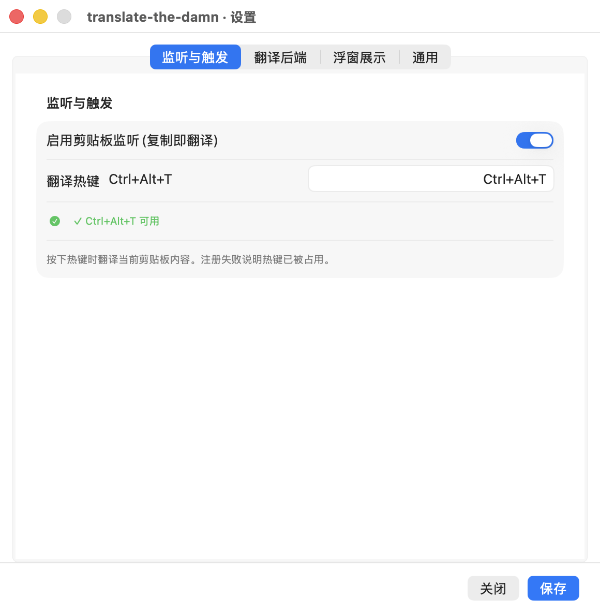

**设置窗口形态**：分页 Tab —— 原生 TabView 四页(触发/后端/浮窗/通用),每页一个 .formStyle(.grouped) 表单,底部常驻保存栏。

**特点**
- 全程原生控件与 grouped Form：Toggle 开关、Picker、Slider、SecureField、roundedBorder 文本框,System Settings 风格的圆角分组卡片,层级清晰。
- 底部常驻操作栏跨页保留,主按钮「保存」用 .borderedProminent 渲染为强调态、置于右下,「关闭」为安静次按钮——按钮序与强调度符合 HIG。
- 颜色与字体全用系统语义色(.secondary/.red/.green)与系统字体,无硬编码色,明暗模式自动适配。
- 与 ZP/Classic 复用同一个 SettingsViewModel,字段/绑定/条件分支完全一致,改风格不改行为,工程上干净。
- 热键校验有实时反馈(可用/占用/格式无效)且配色语义正确(绿/红)。

**不足（按当代 mac 标准）**
| 严重度 | 问题 | HIG / 当代标准依据 |
|---|---|---|
| **P1** | 顶部 Tab 在截图中呈 segmented 胶囊样式(经典 NSTabView 外观),并非当代 Sonoma/Sequoia System Settings 的左侧栏导航。系统设置自 macOS 13 起统一为侧栏式信息架构,顶部分段 Tab 已是上一代观感,与「当代 macOS 标准」的目标定位有差距。 | macOS 13+ System Settings 采用侧栏(NavigationSplitView)导航;顶 Tab 适用于偏好类小窗但不再是『当代标准』范式。 |
| **P1** | Section 标题与 tab 标签重复:tabItem 已标 “监听与触发/翻译后端/…”,每页 Section 又用同一 key 再标一遍同样文字,形成可见的标题冗余(截图第一页可见 tab 与正文都写“监听与触发”)。 | HIG 信息层级:同一标题不应在导航与内容区重复,浪费纵向空间且削弱层级。 |
| **P1** | 分页之间内容高度严重不均(触发页仅 2 项、后端页随后端动态膨胀到多字段),但窗口 minHeight 固定 560,不随当前页 fittingSize 调整。触发页大片空白(截图下半部全空),后端页则可能溢出滚动,体验割裂。 | HIG 留白原则:既要足够留白也不应浪费空间;分页窗口应按当前页内容自适应或取各页统一基线。 |
| **P2** | 热键状态行同时出现字面字符“✓/✗”和 systemImage 的 SF Symbol(checkmark.circle.fill),双重图标;截图里绿色圆勾后又跟一个“✓”。Label 已带语义图标,不应再前置字符 glyph。 | 用系统 SF Symbol 表达状态即可,避免字符 glyph 与符号叠加造成视觉噪声。 |
| **P2** | “浮窗样式(毛玻璃/纯色)”选择器(第140行)仍是 .pickerStyle(.segmented),而“界面风格”已改 .menu,同一窗内两种 Picker 范式并存,风格不统一。 | 同一设置面内控件范式应一致;两项选择项数相近却用不同样式,缺乏一致性。 |
| **P2** | “翻译热键”一行把标签与 roundedBorder 文本框放进 HStack,而其余字段走 Form 的标准 label-control 布局,标签列对齐基线不统一(截图中“翻译热键 Ctrl+Alt+T”后紧跟一个右对齐输入框,与下方 Form 行的对齐不一致)。 | Form 内字段应共用统一的 label 对齐栅格,避免逐行手搭 HStack 破坏对齐。 |

**建议**
- 把顶 Tab 升级为 NavigationSplitView 侧栏导航(四项各配 SF Symbol),贴近当代 System Settings;若保留 Tab,则去掉每页 Section 与 tab 重名的标题。
- 去除 Section 与 tabItem 的标题重复:Section 用更细的子分组名(如“剪贴板”“热键”),或直接用无标题 Section。
- 让窗口高度按当前页 fittingSize 自适应,或为各页设一致的最小内容基线,消除触发页大片空白与后端页溢出的落差。
- 热键状态去掉字面“✓/✗”,只保留 SF Symbol + 文案;成功/失败配 .green/.red 语义色即可。
- 把“浮窗样式”Picker 与“界面风格”统一为同一范式(都 .menu 或都 segmented),保证同窗一致性。
- “翻译热键”改用 Form 标准 LabeledContent / TextField(label) 布局,与其它字段共用对齐栅格。

**发布 / 开发需强调或补充的说明**
- 发布前必须实测真实默认窗口(约 560×640):后端页在选不同后端(HTTP/CLI/Google/Doubao)时字段会动态增减,需验证最长字段组合不溢出或滚动表现可接受;触发页空白需有交代。
- 确认“保存”按钮在每页、深浅模式下都真实渲染为 .borderedProminent 强调态(截图浅色下为蓝色实心,符合预期);键盘焦点下回车默认按钮是否落在“保存”需验证。
- 全键盘可达性验收:Tab 切换、各字段 Tab 序、Picker/Slider 可用键盘操作、保存/关闭可被键盘触发(VoiceOver 朗读标签正确)。
- 界面风格 Picker 已含 7 项(DS/Z/KM/ZP/Classic/O48/MM),需确认 .menu 下拉在最长项与本地化下不截断,切换后即时生效与持久化。
- 明确告知:O48 设置页本身是中性系统外观,真正承载 O48『聚焦』识别度的是浮窗;设置窗与其它风格的设置窗仅布局差异,验收勿误判为风格缺失。

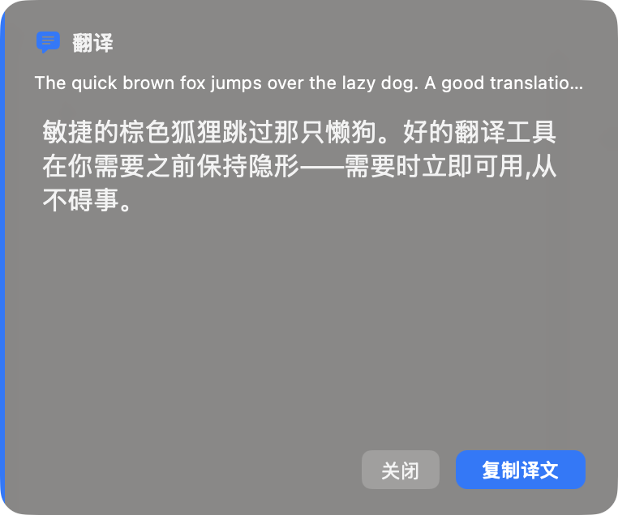

**浮窗特点**
- 真正的原生材质:NSVisualEffectView,acrylic 走 .hudWindow + .vibrantDark、solid 走 .windowBackground 自适应,不是硬编码 darkScrim;cornerRadius 16,圆角 + 系统阴影。
- 前缘 controlAccentColor 强调条为各状态品牌化;Header 配 SF Symbol 状态图标(text.bubble.fill/exclamationmark.triangle.fill)与 loading 内联 spinner,状态语义清晰。
- 正文 16pt + lineSpacing 3 + 可选中 NSTextView + 可滚动,阅读性好;原文 11pt secondaryLabelColor 两行截断,层级分明。
- 主操作“复制译文”用自绘 O48PrimaryButton 实心强调填充——正确解决了 nonactivatingPanel + 振动外观下系统强调按钮会退化为灰色的已知问题;按钮右对齐,关闭(安静)在前、复制(强调)在后。
- 非抢焦点 NSPanel(.nonactivatingPanel + canBecomeKey/Main=false + .floating),进出场为对称的上浮 + 淡入淡出(0.2s),克制不打断。
- 顶部居中定位、按内容 fittingSize 显式 setContentSize,loading→result 状态切换时顶边不跳动。

**浮窗不足**
| 严重度 | 问题 | HIG / 当代标准依据 |
|---|---|---|
| **P1** | acrylic 模式被强制钉死 .vibrantDark,无论桌面浅深都是深色 HUD。截图中“关闭”按钮是灰底灰字的圆角胶囊,在 vibrant-dark 背景上对比极弱、几乎看不清,次操作可发现性差。 | 明暗模式均需保证对比度;振动深色上下文里 .rounded 灰按钮文字对比不足,次按钮也应可清晰辨认。 |
| **P2** | 前缘 accentRail 在截图中不可见(被圆角 masksToBounds 裁掉或与暗底融合),作为“为每个状态品牌化”的核心识别元素却没呈现出来,设计意图落空。 | 强调元素应在实际渲染中可见且达到可感知对比,否则等于无效装饰。 |
| **P2** | acrylic HUD 钉死深色,与系统外观脱钩:浅色桌面/浅色模式用户会看到一个突兀的深色块,且原文 secondaryLabelColor 在 vibrantDark 下虽可读但与正文层级差被压缩(截图原文偏亮,与正文白对比不够拉开)。 | 当代 macOS 浮层倾向跟随系统外观;固定深色需有明确设计理由并保证浅色环境观感。 |
| **P2** | “关闭”按钮文字 12pt 且为系统 .rounded 浅灰,而“复制译文”是 28px 横向内补、24 高的自绘胶囊,两按钮高度/视重不一致(截图中复制按钮明显更高更重),并排时基线与尺寸不齐。 | 并排操作按钮应高度一致、视觉权重协调;主次区分应靠强调色而非尺寸错配。 |

**浮窗建议**
- 让 acrylic 也跟随系统外观(或提供随系统/常深两种),至少在浅色环境验证整体观感;若坚持常深,需重做“关闭”次按钮为深底上可读的描边/半透明胶囊。
- 提升“关闭”按钮在 vibrantDark 上的对比:用 secondaryLabelColor 文字 + 细描边或更亮的填充,确保可发现性;并把它与复制按钮统一高度(同为 24/28pt)。
- 确认 accentRail 真正可见:把它画在圆角内侧且给足宽度/亮度,或改为顶部细 accent 描边,让“状态品牌化”落地。
- 加大原文与正文的层级反差(原文降不透明度或缩小到 11pt 并降亮度),在 vibrantDark 下也保持清晰的主/次。
- 复制成功反馈“已复制 ✓”仅改按钮标题,可补一个短暂的 accent 高亮或勾选动画,增强确认感(可选)。

**浮窗发布 / 开发需强调的说明**
- P0 验收:在浅色桌面 + 浅色系统外观、深色桌面 + 深色外观、以及浅色系统外观下的 acrylic(强制深色)三种组合下,逐一截图核对正文/原文/两个按钮的对比度均达可读标准(尤其“关闭”按钮当前是高风险点)。
- 验证 O48PrimaryButton 在切换系统强调色(蓝/紫/橙等)和明暗切换时通过 viewDidChangeEffectiveAppearance 正确重算 accent,实心填充不退化为灰。
- 验证非抢焦点面板下复制按钮点击区域/命中正常,且面板不会窃取前台 App 焦点(canBecomeKey/Main=false)。
- 验证长译文滚动:scrollHeight 在 autoDismiss>0 时上限 200、否则 280,需确认长文本可滚动且 autohidesScrollers 行为正常,顶部居中定位在多显示器/不同分辨率下不跑偏(当前 topCenterOrigin 取 NSScreen.screens.first,需确认主屏/多屏行为符合预期)。
- 验证 keepOnHover 与 autoDismiss 交互:悬停暂停、移出重启计时;错误态/加载态不显示复制按钮与原文行,状态切换不产生顶边跳动。
- 可访问性:NSTextView 可选中已具备,但需确认 headerIcon/按钮有 accessibilityDescription,VoiceOver 能朗读状态与操作。

---

### 3.5 Z（文档卡） — 评分 4/5

> 底子很正——原生 grouped Form + 真 NSVisualEffectView 材质 + 右下强调保存按钮 + 不抢焦浮窗，是七种风格里较合规的一档;主要欠账在设置预览 hero 的材质名不副实、单页溢出 + 固定 hero 的空间浪费，以及浮窗固定高度留白、accent 按钮硬编码白字与缺键盘可达性这几处可执行的打磨。

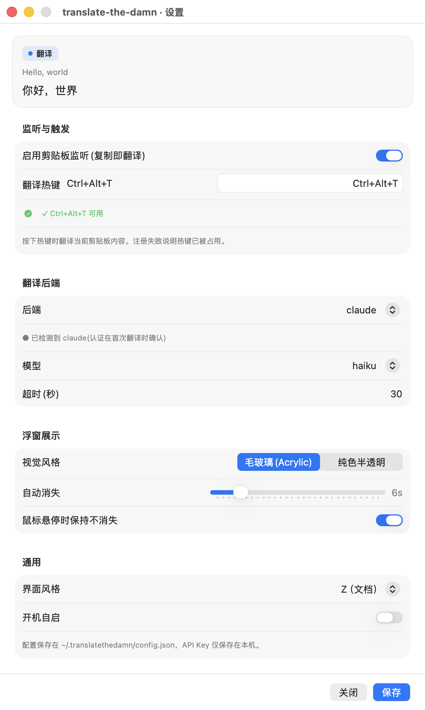

**设置窗口形态**：顶部固定实时预览 hero 卡 + 下方原生 .grouped Form 四分区(监听/后端/浮窗/通用)的单页表单，底部右下强调保存按钮。

**特点**
- 正确采用原生 Form + .formStyle(.grouped) + Section，信息层级与 System Settings 一致；控件全部为原生 Toggle/Picker/Slider/SecureField/TextField。
- 底部操作栏遵循 HIG：保存按钮在右下并用 .borderedProminent 渲染为强调态，关闭为次级按钮，左侧留 saveStatus 反馈位。
- 顶部预览 hero 是该风格独有的『所见即所得』巧思，复刻浮窗的发丝边框+状态药丸+示例原文/译文，意图很好。
- 『界面风格』选择器已按要求从 segmented 改为 .menu 下拉(7 个风格)，省空间且可扩展，符合现状；浮窗『视觉风格』仍为 segmented(仅 2 项，恰当)。
- 颜色多用语义色(secondary/.secondaryLabelColor、Color.accentColor)，状态药丸 label 固定 labelColor 保证任意材质可读。

**不足（按当代 mac 标准）**
| 严重度 | 问题 | HIG / 当代标准依据 |
|---|---|---|
| **P1** | 预览 hero 卡用 .ultraThinMaterial 叠在不透明 grouped Form 窗口上，材质背后没有可透出的内容，实际只渲染成一块近乎纯色的浅灰板(见截屏)，既没复刻出浮窗 .sidebar 的真实磨砂观感，又与下方 grouped Form 的分组背景视觉冲突——『所见即所得』的承诺没兑现。建议预览用与浮窗一致的取色/材质策略，或干脆画成静态卡，别用窗口内毫无意义的 material。 | Materials：磨砂材质应叠在有内容可透出的层之上才有意义；设置窗口主体应是一致的 grouped 背景，不应在其中嵌入一块语义不明的悬浮材质块。 |
| **P1** | 已知默认 560×640 时单页表单溢出滚动，而顶部预览 hero 是固定不滚的(在 VStack 中位于 Form 之上)，会长期占去约 120pt 垂直空间，进一步挤压可视表单区、加重滚动。后端为 http 类时字段更多，溢出更明显。 | System Settings 风格：首屏应尽量让主要分组可见、减少滚动；固定 hero 在小窗下是空间浪费，违背『足够留白但不浪费空间』。 |
| **P2** | 热键状态文案用硬编码 .red / .green(第 58-69 行)，而非系统语义色(.systemRed/.systemGreen 或更佳的语义反馈)。深色模式下饱和绿/红对比与系统控件不一致；且用纯色文字传达成败、未配合足够强的图标语义，色弱用户可达性弱(虽带了 ✓/✗ 符号，但符号是字符不是 SF Symbol 语义渲染)。 | Color：优先系统语义色而非硬编码 RGB/标准色名，明暗模式自适应；状态不应仅靠颜色区分。 |
| **P2** | 预览卡圆角 14、浮窗实际圆角 18(ZPopup 第 95 行),边框都用 separatorColor 但圆角不一致，预览与真实浮窗存在可见差异，削弱『预览即所见』的准确性。 | 一致性：预览应忠实反映目标产物的关键视觉参数(圆角/材质/间距)。 |
| **P2** | 标题栏标题写死中文『translate-the-damn · 设置』(截屏可见)，与 strings 国际化策略脱节；多个字段说明文案(如『按下热键时翻译当前剪贴板内容…』『源语言(可选)』『推理强度』『回退命令』)直接硬编码在视图里，未走 StringsLoader。 | 本地化：用户可见字符串应集中走 strings 资源，不应散落硬编码。 |

**建议**
- 把预览 hero 改为可随窗口高度收起/或仅在窗口足够高时显示；小窗下优先保证表单分组可见，避免固定 hero + 滚动叠加的空间浪费。
- 若保留预览，请用与 ZPopup 完全一致的圆角(18)与材质取色逻辑，让它真正『所见即所得』；或明确降级为静态示意卡并去掉无意义的 .ultraThinMaterial。
- 热键状态色改用系统语义色(.systemGreen/.systemRed 或 .green/.red 的 Color 形式但确保走系统语义)，并把 ✓/✗ 换成 SF Symbol(checkmark.circle/xmark.circle)以保证明暗模式对比与色弱可达性。
- 标题栏标题与所有可见文案统一走 StringsLoader / strings 资源，移除视图内硬编码中文。
- 考虑把后端分区里随后端类型动态出现的多字段做轻量分组或行内说明，减少溢出时的认知负担;长表单可评估是否值得拆为 TabView 或加分隔视觉锚点。

**发布 / 开发需强调或补充的说明**
- 发布前必须在浅色/深色系统外观下各跑一遍，确认热键状态色、预览卡材质、grouped Form 背景对比度全部达标(当前热键色为硬编码,深色需重点核验)。
- 必须验证默认 560×640 窗口下的溢出滚动体验：固定 hero + 滚动 Form 的组合在最小高度时是否仍能露出『保存/关闭』底栏且不被裁切；建议给窗口设最小高度并测 http 后端(字段最多)场景。
- 明确预览 hero 的定位:是『忠实预览』还是『示意装饰』。若声称忠实，需对齐圆角/材质/字号;否则发布说明里应注明它仅为示意，避免用户误判真实浮窗外观。
- 键盘可达性:验证 Tab 焦点顺序覆盖所有字段、Picker(含 .menu 下拉)与底部按钮，Return 触发默认(保存)、Esc 关闭窗口;.menu 风格 Picker 的键盘展开需实测。
- 本地化交接:标题栏与散落硬编码文案需补进 strings 资源并提供译文键，CI 应校验无视图内裸中文字符串。
- 浮窗侧需单独验收(见 popup 部分):空状态留白、accent 按钮白字在非默认强调色下的对比、自动消失/悬停保持行为。

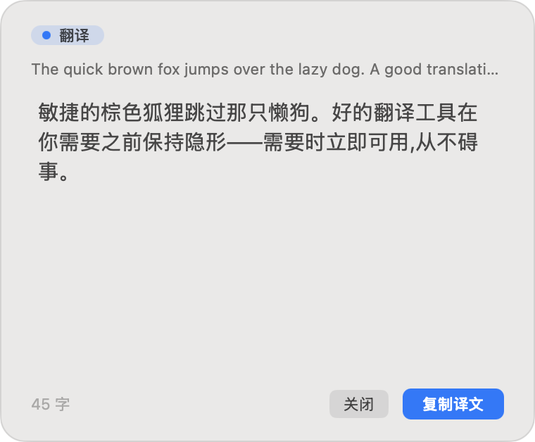

**浮窗特点**
- NSPanel(.nonactivatingPanel)+floating+canBecomeKey/Main=false，正确做到不抢焦点的浮窗;对称 0.2s 淡入淡出，克制。
- NSVisualEffectView 真原生材质:acrylic→.sidebar(active 自适应磨砂)/solid→.windowBackground(不透明)，不硬编码颜色、不强制深色，明暗自适应;发丝边框用 separatorColor 并在 viewDidChangeEffectiveAppearance 重解析，处理到位。
- 主操作『复制译文』为自绘 accent 填充按钮(vibrancy 关闭)，在非 key 面板里仍稳定呈强调态;『关闭』为次级小圆角 NSButton，主次分明且主按钮在右下。
- 状态药丸:tint 胶囊+状态点/加载 spinner+labelColor 文字，loading/result/error 三态清晰;字号统一走 systemFont，原文 11pt 次级色、译文 15pt 主色、行距 3，排版有编辑卡气质。
- showAndPlace 先 layout 再 setContentSize 再定位，处理了 loading→result 高度变化的顶边锚定，工程上严谨。

**浮窗不足**
| 严重度 | 问题 | HIG / 当代标准依据 |
|---|---|---|
| **P1** | 截屏显示译文仅 3 行，但卡片下方留有大片空白:scrollHeight 取固定 min(200,280)=200pt(第 136 行)，与实际内容高度无关，短译文时卡片远高于所需，浪费空间且空得突兀。应让译文区按内容自适应高度(设上限+滚动)，而非恒定 200pt。 | Layout/留白:浮窗应贴合内容尺寸，足够留白但不浪费;固定高度导致大段空状态留白不符合当代浮窗预期。 |
| **P1** | accent 主按钮文字硬编码 NSColor.white(第 293 行)。当系统强调色为浅色(如黄色/部分自定义 accent)时，白字落在浅底上对比不足，违反对比度要求;应改用随强调色自适应的前景(如 controlAccentColor 上推荐的 .white/.black 二选或用系统 .borderedProminent 让系统处理)。 | Color/Contrast:前景文字须在其背景上满足对比度;不应假设强调色一定够深。 |
| **P2** | 卡片圆角 18pt 偏大、且 hasShadow 的窗口阴影 + 1px separator 边框同时存在，发丝边框在磨砂卡上有时显得多余/与系统弹窗(通常仅靠阴影+材质)不完全一致;另外圆角 18 与设置预览卡 14 不一致(跨视图自相矛盾)。 | Materials/一致性:系统浮层通常以材质+阴影定义边界，叠加显式硬边框需克制;同一风格内圆角应统一。 |
| **P2** | ‘N 字’字数统计用 tertiaryLabelColor 放在左下(第 166-167 行)，在 .sidebar 磨砂上三级色可能偏淡;且该信息为低价值装饰，对核心任务(读译文/复制)无帮助，属于自定义而非系统惯例元素。 | 可读性/克制:三级文字在磨砂材质上需复核对比;非必要装饰元素应让位于核心信息。 |
| **P2** | 浮窗不可成为 key 窗口，复制/关闭只能靠鼠标点击，缺少键盘可达性(如 Esc 关闭、Cmd+C 复制)。对纯键盘/无障碍用户不友好。 | Accessibility/Keyboard:关键操作应有键盘通路;非激活面板可通过监听 local event 或临时可 key 化补足。 |

**浮窗建议**
- 译文滚动区改为按内容自适应高度(intrinsic + 最大高度上限后再滚动)，消除短译文时的大段空白;footer 紧贴内容底部。
- accent 按钮前景色改为自适应:用系统 .borderedProminent/controlAccentColor 配套前景，或根据 accent 亮度选择黑/白字，保证任意强调色下对比达标。
- 统一圆角(浮窗与设置预览都用同一值，建议回到系统弹窗常见的 10-12pt)，并评估是否弱化/去掉显式 1px 边框、更多依赖材质+阴影定义边界。
- 复核 ‘N 字’在 .sidebar 磨砂浅/深底下的对比;若保留，至少提到 secondaryLabelColor 或考虑移除以减负。
- 补充键盘可达性:Esc 关闭、Cmd+C 复制(可在 keyDown / performKeyEquivalent 处理，或在显示时短暂允许成为 key)。
- 为状态点/药丸补 accessibilityLabel，VoiceOver 能读出『翻译完成/翻译中/出错』状态。

**浮窗发布 / 开发需强调的说明**
- 必须在浅色/深色桌面、以及把窗口浮在亮图/深图/纯色不同背景上各验证:.sidebar 磨砂可读性、发丝边框是否仍可见、译文与原文对比度。
- 必须验证主按钮在非默认系统强调色(尤其浅色 accent，如黄/橙)下白字对比达标;这是当前硬编码 white 的最大风险点。
- 必须做空/短内容的留白验收:短译文不应留大段空白(当前固定 200pt 会);超长译文需验证滚动与最大高度上限。
- 确认主按钮在非 key 浮窗下确实渲染为强调态(自绘 accent 已处理，但需在多 accent 色+明暗下回归)。
- 验收键盘与无障碍:至少 Esc 关闭可用;VoiceOver 能读出状态药丸与按钮;自动消失计时与悬停保持(keepOnHover)交互需实测不冲突。
- 顶部居中定位仅取 NSScreen.screens.first(第 323 行):多显示器/非主屏触发时落点是否正确需验证。

---

### 3.6 MM（简洁磨砂） — 评分 4/5

> MM 风格设置窗口是教科书级的原生 grouped Form,浮窗也真用了 NSVisualEffectView 磨砂与语义色,整体很贴近当代 macOS 标准;主要扣分在主按钮自绘+硬编码白字(应改原生强调态)、全局键盘/无障碍可达性缺失,以及浮窗短内容的大块空白与单页设置溢出滚动。


**设置窗口形态**：单页分组表单(Form + .formStyle(.grouped),4 个 Section:监听与触发 / 翻译后端 / 浮窗展示 / 通用),底部自定义工具栏。真实运行约 560×640pt,内容超高需滚动。

**特点**
- 全程原生 SwiftUI Form + Section + .formStyle(.grouped),信息层级与 System Settings 一致,分组标题、行内 label-trailing 控件布局规范
- 控件均为原生:Toggle 开关、Picker(.menu / .segmented)、Slider、SecureField、TextField(.roundedBorder),无自绘控件
- 底部主操作区把「保存」置于右下并用 .borderedProminent 渲染为强调态,「关闭」为默认态副按钮,符合主次按钮规范
- 热键校验状态用语义色(.green/.red)+ SF Symbol(checkmark/xmark.circle.fill)与 .caption 说明文字,反馈清晰
- 辅助说明文字统一用 .font(.caption) + .foregroundStyle(.secondary),留白克制不堆砌
- 分组卡片背景、圆角与描边由系统 grouped 表单自动渲染,明暗模式自适应

**不足（按当代 mac 标准）**
| 严重度 | 问题 | HIG / 当代标准依据 |
|---|---|---|
| **P1** | 「保存」虽渲染为 .borderedProminent,但未绑定 .keyboardShortcut(.defaultAction)/Return,实测回车不会触发保存;键盘可达性不完整,prominent 仅为视觉而非真正默认动作。 | HIG Buttons/Keyboard:默认按钮应可由 Return 触发,prominent 主按钮通常即默认动作,二者应一致。 |
| **P2** | 同一窗口内视觉风格用 .segmented(毛玻璃/纯色半透明),界面风格用 .menu 下拉,两种选择器混用,控件语言不统一。建议两项都用 .menu(界面风格已 7 项无法 segmented),或将仅 2 项的视觉风格也归为下拉/Picker(.inline)以保持一致。 | HIG Consistency/Pickers:同一界面相同语义的离散单选应使用统一的控件样式。 |
| **P2** | 单页 4 分区在默认 ~560×640 窗口会溢出滚动(已知背景),内容量已接近 System Settings 的多面板阈值;长滚动单页缺少分区导航,可发现性下降。 | macOS 14/15 Settings 模式:内容超过一屏时倾向侧栏/多面板(NavigationSplitView)或可折叠分区,而非长滚动单页。 |
| **P2** | 「超时(秒)」「自动消失」等数值字段用纯 TextField/Slider,超时为自由文本输入且无 Stepper/单位校验,易输入非法值;数值项建议配 Stepper 或带 formatter 的字段。 | HIG Steppers/Text fields:数值范围输入宜用 Stepper 或带格式校验的字段,避免无约束自由文本。 |
| **P2** | 窗口高度硬编码 minHeight:560,未随内容/分区折叠自适应;在更小屏或更多后端字段展开时仍固定滚动,缺少尺寸自适应。 | HIG Windows:设置窗口尺寸宜与内容相称并允许合理自适应,而非固定最小高度强制滚动。 |

**建议**
- 给「保存」加 .keyboardShortcut(.defaultAction),并给「关闭」加 .keyboardShortcut(.cancelAction),让 Return/Esc 可达,与 prominent 视觉一致。
- 统一两个选择器:界面风格已 7 项保留 .menu;把仅 2 项的「视觉风格」也改为 .menu 或并入同一视觉语言,避免 segmented 与 menu 混用。
- 内容超一屏:评估改为 NavigationSplitView 侧栏(监听/后端/浮窗/通用 4 项)或可折叠 DisclosureGroup,减少长滚动、提升分区可发现性。
- 数值字段(超时、自动消失)补 Stepper 或 formatter 校验与单位提示,防非法输入;自动消失已有 Slider+读数,超时也应有约束。
- 让窗口高度随内容自适应(idealHeight + 合理 max),小屏下保证底部主操作区始终可见不被滚动吞没。
- 保存反馈(saveStatus)目前只在左下以 caption 显示,建议明确成功/失败语义色或短暂高亮,增强可感知性。

**发布 / 开发需强调或补充的说明**
- 验收:实测「保存」按钮在浅色/深色下确为系统强调态(controlAccentColor),且 Return 能触发、Esc 能关闭窗口。
- 验收:在默认窗口尺寸(~560×640)及更小屏下,底部「关闭/保存」操作区不被滚动区域遮挡,始终可见可点。
- 验收:Graphite 强调色及「增强对比度」辅助功能开启时,强调按钮与分组描边对比度仍达标。
- 明确:界面风格选择器已从 segmented 改为 .menu(7 项)为现状;若再加风格需确认 .menu 仍可承载,并考虑分组。
- 补充:超时/自动消失等数值输入的合法范围与非法值处理(占位、回退默认值)需在交接文档写清。
- 键盘可达性:全表单需可用 Tab 遍历所有控件(Toggle/Picker/Slider/TextField),并验证 VoiceOver 朗读分区标题与控件标签。

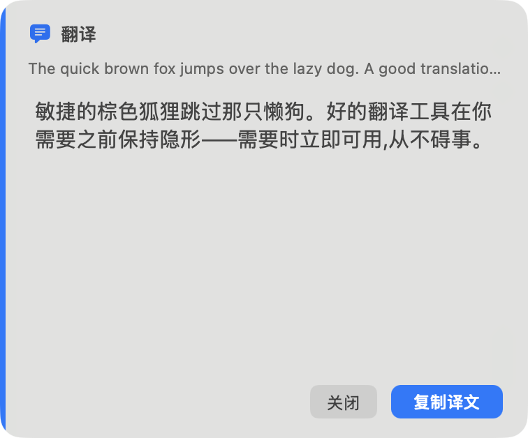

**浮窗特点**
- 真正使用 NSVisualEffectView 磨砂材质:acrylic=.popover/.active/.behindWindow,solid=.contentBackground/.inactive,而非硬编码色或 darkScrim
- 非抢焦点窗口正确:NSPanel(.nonactivatingPanel)+ canBecomeKey/Main=false + .floating,符合浮窗不夺焦规范
- 头部用 SF Symbol(text.bubble.fill / exclamationmark.triangle.fill)+ 语义色(controlAccentColor / systemOrange),loading 用原生 NSProgressIndicator 行内 spinner
- 文字层级用语义色:标题 labelColor(13pt semibold)、原文 secondaryLabelColor(11pt 截断 2 行)、译文 labelColor(15pt 行距 2),译文 NSTextView 可选中
- 12pt 圆角 + hasShadow + 顶部居中落位 + 0.2s 升起/淡入淡出对称动效,卡片质感统一
- 右下主次按钮:关闭(.rounded 副按钮)+ 复制译文(强调填充),顺序 close→copy 正确;遵循 keepOnHover / autoDismissSeconds 配置

**浮窗不足**
| 严重度 | 问题 | HIG / 当代标准依据 |
|---|---|---|
| **P1** | 「复制译文」是自绘 MMPrimaryButton:手动用 controlAccentColor 填充 layer + 硬编码 NSColor.white 文字,而非原生 .borderedProminent/NSButton 强调按钮。硬编码白字在浅色强调色(如黄色 Graphite/部分强调色)下对比度不足,且不随系统按钮样式/辅助功能(增强对比度)更新。 | HIG Buttons:主操作应使用系统强调按钮(.borderedProminent),由系统决定前景色以保证各强调色/对比度模式下可读,避免硬编码 white。 |
| **P1** | 浮窗为非 key 的 NSPanel 且无键盘可达性:复制/关闭按钮无 keyEquivalent,Esc 无法关闭、Return 无法复制;键盘与 VoiceOver 用户无法操作浮窗。 | HIG Keyboard/Accessibility:即便是浮层,关键操作也应有键盘等价(Esc 关闭),并对辅助技术可达。 |
| **P2** | 译文滚动区高度固定(200/280pt),短译文时(如截图)正文与按钮间留下大片空白,浮窗显得空旷、浪费纵向空间;高度未随内容自适应。 | macOS 留白原则:留白应服务层级而非产生大块死区;短内容浮窗应收缩高度而非固定撑高。 |
| **P2** | 原文标签固定 11pt 且最多 2 行截断,字号偏小、在磨砂背景上 secondaryLabelColor 对比度本就偏弱,小字 + 弱色 + 截断三者叠加,原文可读性受限。 | HIG Typography/Color:正文级辅助信息字号不宜过小,弱化色需保证在半透明材质上的最小对比度。 |
| **P2** | 「已复制 ✓」用文字内嵌 emoji/勾号表达状态,而非系统化的图标或短暂强调态;复制成功反馈不够原生与无障碍友好(VoiceOver 不会清晰播报状态变化)。 | HIG Feedback:状态变化宜用语义控件/可被辅助技术识别的方式,而非纯字符拼接。 |

**浮窗建议**
- 把复制按钮改为原生强调按钮(NSButton bezelStyle .push + .controlAccentColor / SwiftUI .borderedProminent),让系统决定前景色,移除硬编码 white,保证各强调色与增强对比度下可读。
- 为浮窗加键盘可达:Esc 关闭、Cmd+C/Return 复制(给按钮设 keyEquivalent),并补 accessibilityLabel/role,使 VoiceOver 可读可操作。
- 让浮窗高度随译文长度自适应(在最小/最大区间内 fittingSize),短译文收缩、消除正文与按钮间的死区。
- 原文标签字号上调(≥12pt)或改用 labelColor 的略弱变体,确保在 .popover 磨砂材质上对比度达标;必要时允许展开查看完整原文。
- 复制成功反馈改为图标态(checkmark.circle)或按钮短暂强调高亮,并触发 accessibility 通知,而非仅替换文字。
- 在浅色与深色桌面、不同强调色下实测 acrylic(.popover)与 solid 两种材质的文字对比度,确保译文/原文/标题均达 WCAG 对比基线。

**浮窗发布 / 开发需强调的说明**
- 验收:复制按钮在所有系统强调色(含 Graphite/黄色)+「增强对比度」开启时文字仍清晰,确认未硬编码 white(当前实现已硬编码,发布前必须改原生强调态)。
- 验收:浮窗在浅色桌面 + 深色桌面、acrylic 与 solid 两种材质下,标题/原文/译文对比度均达标,磨砂不致正文糊化。
- 验收:Esc 可关闭浮窗、键盘可触发复制;VoiceOver 能朗读头部状态、原文、译文并操作按钮。
- 验收:短译文(1-2 行)与长译文(超 280pt 滚动)两种极端下,浮窗高度自适应且无大块空白或被截断。
- 补充:autoDismissSeconds=0(不自动消失)与 keepOnHover 组合下的关闭路径需可达(键盘/点击均可)。
- 明确:accentLine 4pt 品牌线与头部图标均依赖 controlAccentColor,需确认随系统强调色实时变更(viewDidChangeEffectiveAppearance 已处理按钮,其余 CGColor 着色项也应复核)。

---

### 3.7 DS（清晰玻璃 + 斜体原文） — 评分 4/5

> 设置窗口几乎是教科书级的原生 System Settings 风格(原生 Form/Section/控件/右下强调按钮)；浮窗用纯 AppKit 手绘出干净玻璃卡、斜体原文有辨识度，但主按钮强调态/对比度/对焦反馈靠硬编码维持，明暗与不同强调色下需验证。

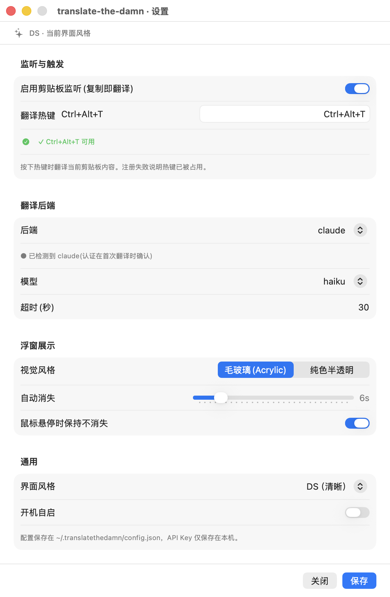

**设置窗口形态**：单页分组表单(Form + .formStyle(.grouped))，顶部风格指示条 + 底部固定操作栏，4 个 Section：监听与触发 / 翻译后端 / 浮窗展示 / 通用

**特点**
- 原生 Form + .formStyle(.grouped)，四个 Section 分组与 macOS 14/15 System Settings 的信息层级一致，分组标题、卡片圆角、行内分隔均由系统渲染
- 控件全部原生且语义正确：Toggle 开关、Picker(.menu/.segmented)、Slider + monospacedDigit 数值、.roundedBorder TextField、SecureField 存 API Key
- 主操作按钮位于右下角并渲染为 .borderedProminent 强调态，关闭为默认次级按钮，符合 macOS 主/次操作摆位约定
- 颜色用系统语义色 .secondary/.red/.green 与 .caption，未见硬编码色；热键校验有即时 ✓/✗ 状态反馈
- 顶部 sparkles + 'DS · 当前界面风格' 指示条克制、不抢视线，作为风格自识别是合理的轻量标识

**不足（按当代 mac 标准）**
| 严重度 | 问题 | HIG / 当代标准依据 |
|---|---|---|
| **P1** | 窗口用 .frame(minWidth:520,minHeight:560)，但真实默认约 560×640、四个 Section 全展开会纵向溢出进入滚动。截屏是撑高后的完整态，实际运行首屏看不全，用户需滚动才能到达底部保存按钮；虽然底部操作栏已固定，但内容区滚动时缺少滚动边缘的分层提示，层级感会弱。 | macOS HIG Settings：设置窗口应在默认尺寸内呈现完整层级或采用合理的尺寸自适应；长表单滚动时主操作区与内容区的视觉分层要明确(scroll edge effect) |
| **P2** | 两个 Picker 呈现不统一：'视觉风格(毛玻璃/纯色)' 用 .segmented，'界面风格' 用 .menu。同一窗口内两种选择控件并列，视觉上不协调。视觉风格只有 2 项用 segmented 尚可，但与下方 menu 并列时显得随意。 | macOS HIG：同类选择控件在同一界面应保持一致的呈现方式；segmented 适合 2-4 个等权项，menu 适合多项，混用需有明确理由 |
| **P2** | 自定义顶部风格指示条用硬编码字号 .font(.system(size:11))，未走 .caption 等动态字体；'翻译热键' 这类 Label 与 TextField 的对齐用手搭 HStack，未用 LabeledContent，在不同语言/字号下标签列宽不会自动对齐。 | macOS 14+ 推荐用 LabeledContent 做表单标签-控件对齐；字号应优先用语义字体以支持动态类型/本地化 |
| **P2** | 保存按钮未绑定快捷键(未见 .keyboardShortcut(.defaultAction))，关闭也无 .cancelAction/Esc。此窗口是显式保存模型，缺回车提交/Esc 关闭不符合键盘可达预期，也使主按钮无默认按钮高亮。 | macOS HIG 键盘：主按钮应可由 Return 触发(默认按钮)，取消应可由 Esc 触发 |
| **P2** | '后端/模型' 等 Picker 标签与右侧值之间靠 Form 默认布局，但 backendSection 内的 SecureField/TextField(API Key、Endpoint、目标语言等)直接堆叠、无 LabeledContent 对齐，且这些动态字段在切换后端时出现/消失，缺过渡，表单高度会跳变。 | macOS HIG：表单字段动态增减时应保持布局稳定与对齐一致 |

**建议**
- 核实默认 560×640 下首屏可见性：内容溢出时确保底部操作栏与滚动内容有清晰分层(滚动边缘效果/分隔阴影)，必要时分页或按 Section 折叠以减少首屏滚动
- 统一两个 Picker 的呈现：建议都用 .menu(与 7 项界面风格保持一致)，或为视觉风格的 segmented 给出明确一致性理由
- 表单标签-控件用 LabeledContent 替代手搭 HStack，保证多语言/字号下标签列自动对齐；顶部指示条字号改用语义字体
- 给保存按钮加 .keyboardShortcut(.defaultAction)、关闭加 .cancelAction，补齐键盘可达与默认按钮高亮
- 后端切换时的动态字段增减加入轻微动画或预留布局，避免表单高度跳变

**发布 / 开发需强调或补充的说明**
- 发布前务必在默认 560×640 窗口实测首屏：确认保存按钮固定可达、内容滚动时底部栏不被遮挡，且滚动边缘有分层提示
- 验证窗口最小尺寸与可调整尺寸行为：minHeight 560 与真实内容溢出的关系要明确，避免用户在小屏上看不全
- 确认明暗模式下 Form 分组背景、分隔线、.secondary 文本对比度均达标(语义色已用对，但要实跑两种外观截图核对)
- 补齐键盘可达：Return 保存、Esc 关闭、Tab 焦点顺序覆盖所有字段(含 SecureField)
- 统一 Picker 呈现风格后回归测试 segmented→menu 改动对所有 7 种 uiStyle 页面的影响

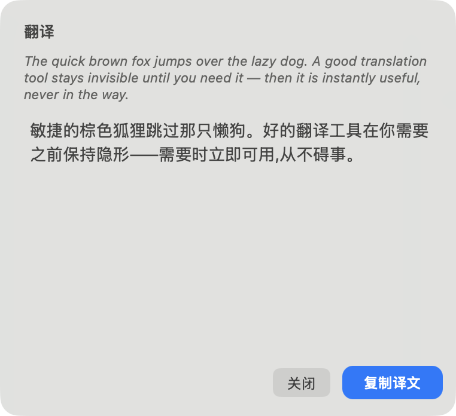

**浮窗特点**
- 真正的原生材质：NSVisualEffectView + .behindWindow，acrylic 用 .popover/.active、solid 用 .contentBackground/.inactive，12pt 圆角 + 系统阴影，不是硬编码色或 darkScrim
- 斜体原文是独有设计语言：通过 NSFontManager 转 italic 渲染英文原文，11pt secondaryLabelColor，与 14pt labelColor 译文形成清晰主次层级
- 非抢焦实现规范：NSPanel(.nonactivatingPanel) + canBecomeKey/Main=false + .floating，不打断当前应用焦点，符合浮窗类工具的预期
- 主操作'复制译文'在右下角、关闭在其左，用胶囊形 controlAccentColor 填充把主操作渲染为强调态；译文区可滚动/可选中，标题区 spinner 表示加载
- 进入/退出对称的上浮 + 淡入(0.2s easeIn/easeOut)，克制不喧宾夺主

**浮窗不足**
| 严重度 | 问题 | HIG / 当代标准依据 |
|---|---|---|
| **P1** | 主按钮用自定义 DSPrimaryButton 手绘 controlAccentColor 填充 + 硬编码白色文字(NSColor.white)。当系统强调色为浅色(如黄色/石墨灰浅态)或高对比度模式下，白字在浅底上对比度可能不达标；且它绕过了系统按钮的按压/悬停/禁用态渲染，无原生反馈。注释已自承在非 key 面板下系统不渲染强调态才这么做，但代价是丢失全部系统态。 | macOS HIG 颜色/按钮：强调按钮文字应保证与填充的对比度(系统通常按强调色明度自适应黑/白文字)，并应有按压/悬停/禁用视觉反馈 |
| **P1** | 面板 canBecomeKey=false，主按钮无默认按钮高亮、无焦点环、无 Return/Esc 快捷键(复制/关闭仅靠鼠标点击)。对一个会自动消失的浮窗，键盘可达性几乎为零，无法用键盘复制或立即关闭。 | macOS HIG 键盘可达性：关键操作应可由键盘完成；浮窗虽不抢焦，仍宜提供 Esc 关闭、⌘C/Return 复制等本地快捷键 |
| **P1** | acrylic 用 .behindWindow 透过桌面/底层窗口取色，未强制 appearance(appearance=nil 跟随系统)。在浅色桌面壁纸或亮色底层窗口下，secondaryLabelColor 的斜体原文与 .popover 材质的对比度可能偏低，11pt 斜体本就最弱。截屏是中性灰底，未覆盖极端壁纸场景。 | macOS HIG 材质/对比度：使用 vibrancy 材质时须验证前景文本在各种底层内容下的可读性，尤其次级/小字号文本 |
| **P2** | 面板尺寸固定逻辑：scrollWidth=350 写死，scrollHeight 取 min(...,280)，内容用 fittingSize。窄固定宽度对长中文译文换行偏窄，且窗口宽度不随内容/屏幕缩放自适应(顶部居中固定贴边 12pt)。 | macOS HIG：浮层尺寸宜与内容量和屏幕尺寸合理适配，避免长文本被压在过窄列内 |
| **P2** | 关闭按钮用 .rounded bezel 原生灰按钮，而复制用自绘胶囊；两者圆角/高度/内边距风格不完全一致(复制 cornerRadius 9、height 28、+32 宽度硬编码)，并排时视觉权重与几何不齐整。 | macOS HIG：同一按钮组内的次级与主按钮应在尺寸、圆角、基线上视觉对齐 |

**浮窗建议**
- 主按钮文字颜色按强调色明度自适应黑/白(或用系统 .selectedContentBackgroundColor / NSColor.controlAccentColor + 动态前景)，并补按压/悬停/禁用态；考虑用 .borderedProminent 等价的可控渲染而非纯硬编码白
- 为浮窗加本地键盘快捷键：Esc 关闭、Return 或 ⌘C 复制(可在 keyDown 或 local monitor 中处理，无需抢焦)
- 在浅色/深色桌面与亮色底层窗口下实测斜体原文(11pt secondaryLabelColor)的对比度，必要时为 acrylic 材质叠一层极淡的自适应底色或提高原文字号/明度
- 让关闭按钮与复制按钮在高度、圆角、基线上对齐(统一为同一套度量)，避免一原生一自绘的几何错位
- 宽度/高度按内容与屏幕适度自适应(尤其长中文译文)，而非固定 350 宽

**浮窗发布 / 开发需强调的说明**
- P0 级验证项：把系统强调色依次切到 蓝/紫/粉/红/橙/黄/绿/石墨 八色，逐一截图确认胶囊主按钮文字(当前硬编码白)在每种强调色上对比度达标，尤其黄色
- 在浅色壁纸、深色壁纸、亮色底层窗口三种场景下实测 acrylic 浮窗：确认斜体原文与译文均可读，对比度达 WCAG/系统标准
- 确认主按钮在视觉上'真的是强调态'而非灰色次级按钮(非 key 面板下系统不渲染强调，已自绘解决，但需回归验证不退化)
- 补浮窗键盘可达：Esc 关闭 / Return 或 ⌘C 复制，并验证不破坏 nonactivating 非抢焦特性
- 验证空/错误/加载三态留白与布局稳定：加载态隐藏原文、错误态用 systemOrange，需确认窗口高度切换不跳变、自动消失计时在 hover 时正确暂停
- 明暗模式各跑一遍：solid(.contentBackground/.inactive) 与 acrylic(.popover/.active) 两种 style 在两种外观下均需截图核对材质与文字对比度

---


---

## 4. Part 2 — 浮窗的两种视觉风格（acrylic / solid）

浮窗的「视觉风格」由 `config.popup.style` 控制，有两种取值，对照锚点风格 O48 的浮窗：

| acrylic（毛玻璃） | solid（纯色半透明） |
|---|---|
|  | 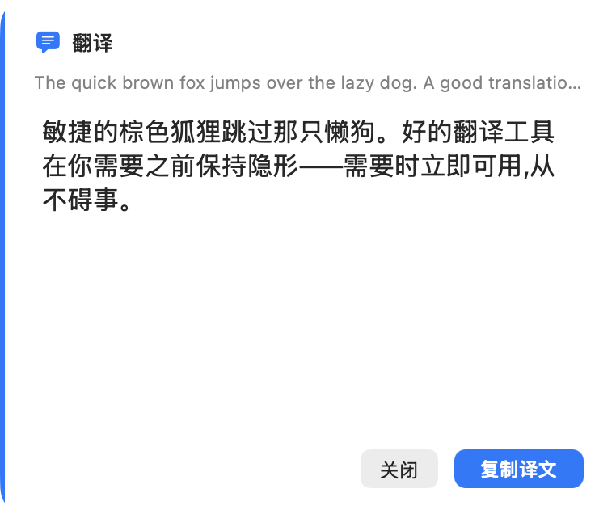 |

> 对照锚点风格 O48 的浮窗。acrylic 用 `.popover`/`.behindWindow`/`.active` 透出桌面、文字随材质明暗自适应；solid 用更接近不透明的 `.contentBackground`/`.inactive` 背景。

### 4.1 acrylic（毛玻璃）
**特点**
- 材质 .hudWindow + blendingMode .behindWindow + state .active，且 appearance 被钉死为 .vibrantDark——这是 Spotlight 式聚焦 HUD 的招牌：始终暗、始终 vibrant、透出桌面。
- 因为外观被钉为 vibrantDark，系统语义色（labelColor/secondaryLabelColor/tertiaryLabelColor）在 vibrant-dark 上下文里解析为浅色，正文白字、源文浅灰字，按构造保证图层内部对比；无任何硬编码色或 darkScrim。
- 保留 O48 招牌元素：3pt controlAccentColor 强调侧条、SF Symbol 状态字形 + 行内 spinner、右下 controlAccentColor 强调态主按钮（复制译文，O48PrimaryButton 自绘 accent 填充以绕开非 key 面板/vibrant 下 bezelColor 失效）、安静的次按钮（关闭）。
- 截图中聚焦感强、视觉更有质感与品牌识别度，16pt 正文 + 3pt 行距阅读舒适；不随系统明暗变化，外观恒定。

**不足**
| 严重度 | 问题 | 依据 |
|---|---|---|
| **P0** | 对比度不稳定是核心风险：blendingMode=.behindWindow 让 .hudWindow 直接透出桌面，HUD 本体偏暗灰半透明（见 acrylic 截图整张卡片透出底层）。白字在深色/中性桌面上可读，但在亮色壁纸、浅色文档或纯白窗口背景上，暗灰 HUD 与白字的对比会被底色抬升、显著塌陷，落到 4.5:1 以下。钉死 vibrantDark 只保证了语义色解析为浅色，并不保证 HUD 自身与桌面之间有足够对比——这正是把可读性押在用户桌面背景上的不可控设计。 | 材质/对比度：HIG 要求半透明绝不得损害内容可读性；vibrancy 材质上的文本应保证在所有背景下 ≥4.5:1。behind-window 透出桌面使对比度依赖外部背景，违反该原则。 |
| **P1** | 可预测性差：同一份译文在不同桌面/不同时刻（换壁纸、切换到不同应用窗口背后）观感与可读性会变化，用户无法预期浮窗长什么样。对一个一闪即逝、autoDismiss 的翻译 HUD 而言，瞬时可读性至关重要，behind-window 采样引入了不可预测的视觉波动。 | 可预测性：HUD/瞬态 UI 应在任意上下文中保持稳定一致的呈现，behind-window 透背破坏了这一点。 |
| **P2** | 与当代 macOS 明暗一致性脱节：acrylic 钉死 vibrantDark，无论系统处于浅色还是深色模式都强制呈暗 HUD。在浅色系统下，一个孤立的深色浮窗与周围浅色环境格格不入，不符合 System Settings 风格随外观自适应的当代观感；这是刻意的品牌选择，但代价是一致性。 | 外观一致性：当代 mac 应用应尊重系统明暗外观；强制单一暗外观属可接受的 HUD 惯例（Spotlight），但需明确这是设计取舍而非默认推荐。 |
| **P2** | headerIcon 与 accentRail 使用 controlAccentColor（默认蓝），在 vibrantDark + behind-window 透出亮桌面时，accent 蓝侧条/图标对比也可能受底色影响；O48PrimaryButton 已用 allowsVibrancy=false 自绘 accent 填充规避，但 3pt 侧条与 13pt 图标未做同等兜底。 | 强调色对比：accent 元素在 vibrancy + 透背环境下需保证自身可辨识，建议比照主按钮做去 vibrancy 兜底。 |

**建议**
- 不要把 acrylic 设为默认。它适合追求质感/品牌的进阶用户在深色桌面下使用，但默认值应选对比度更稳的 solid。
- 若保留 acrylic，把可读性从'押注桌面背景'改为'按构造保证'：要么在 visualEffectView 与文字之间叠一层低不透明度纯黑 scrim（仅作对比兜底，不是硬编码主题色）以托住白字，要么降低 behind-window 透出强度，确保 HUD 本体相对桌面恒有足够对比。
- 把 accentRail（3pt 侧条）与 headerIcon 比照 O48PrimaryButton 做 allowsVibrancy=false / 重解析 cgColor 的兜底，保证强调元素在 vibrant 透背下稳定。
- 为 acrylic 单列对比度验收：在浅色壁纸、纯白文档、深色壁纸、彩色高饱和壁纸四类背景上分别截屏，确认白字正文、浅灰源文、accent 侧条/按钮、systemOrange 错误文字均 ≥4.5:1（大字号正文可放宽到 3:1，但源文 11pt 须按正文 4.5:1 卡）。

### 4.2 solid（纯色半透明）
**特点**
- 材质 .windowBackground + blendingMode .behindWindow + state .inactive，且 appearance=nil 跟随系统明暗；浅色环境下呈近白卡片，正文 .labelColor 解析为黑色，与系统设置/通知卡片观感一致，符合当代 macOS。
- 全部走系统语义色（labelColor/secondaryLabelColor/tertiaryLabelColor/controlAccentColor），无硬编码色或 darkScrim；暗色模式下整张卡片与文字一并翻转，对比关系自洽。
- 可预测性强：卡片背景几乎不受桌面壁纸影响（见 solid 截图近白且稳定），文字对比度稳定，是两种风格里更安全的默认值。
- 保留 O48 招牌元素：3pt controlAccentColor 强调侧条、SF Symbol 状态字形 + 行内 spinner、右下强调态主按钮（复制译文）+ 安静的次按钮（关闭），层级清晰。
- 截图中文本 16pt + 3pt 行距阅读舒适，源文 11pt 次级灰、标题 13pt semibold，信息层级分明。

**不足**
| 严重度 | 问题 | 依据 |
|---|---|---|
| **P1** | 代码注释自称 opaque/不透明，但实际仍是 blendingMode=.behindWindow + .windowBackground + state=.inactive——这是 behind-window 采样而非真正不透明。意味着 solid 仍会透出少量桌面/底层窗口色，在高饱和或亮壁纸上卡片白点会被轻微染色，与命名（纯色）和注释承诺不符。若要真正稳定的纯色卡片，应改用 state=.active（或 .followsWindowActiveState）并配合 .withinWindow，或在 visualEffectView 下叠一层不透明 controlBackgroundColor 兜底层。 | 材质/对比度：HIG 要求半透明仅作点缀且不得损害内容可读性；命名为 solid 的风格应当提供可预测、与背景解耦的对比度。 |
| **P2** | state=.inactive 会让材质渲染成失活（更灰/更暗）的版本，而非活动态的明亮卡片。对一个常驻 .floating、canBecomeKey=false 的非激活面板，inactive 是刻意选择，但视觉上卡片偏灰、accent 侧条与主按钮的鲜亮度被削弱，观感不如系统设置面板那样干净通透。建议 .followsWindowActiveState 或直接 .active，让材质呈现活动态白。 | 材质状态：System Settings 风格卡片应呈活动态明亮材质，inactive 态削弱了当代 mac 的通透观感。 |
| **P2** | 暗色模式下未在截图中验证。solid 跟随系统暗色后，.windowBackground 暗材质 + 白文字本应自洽，但 accent 侧条（3pt）与主按钮在暗材质上的对比、以及 systemOrange 错误态文字在暗卡上的对比均需逐一核验，目前缺暗色截屏证据。 | 明暗对比度：HIG 要求两种外观下文本与控件均满足 4.5:1 对比；暗色态需补证。 |

**建议**
- 把 solid 设为默认风格：对比度与背景解耦、可预测，最贴近当代 macOS（通知/系统设置卡片）的安全选择。
- 修正实现以名副其实：若目标是真纯色，改 state=.active（或 .followsWindowActiveState）并考虑 .withinWindow + 底层不透明 controlBackgroundColor；若有意保留轻微透出，则把命名/注释从 opaque 改成 translucent 以免误导。
- 补一组明暗双模式截屏（亮壁纸/暗壁纸 + 系统亮/暗外观）纳入 UI 验收，确认 accent 侧条、主按钮、systemOrange 错误文字在两种外观下对比度均 ≥4.5:1。

### 4.3 取舍与默认建议
默认建议选 solid。两者的分水岭是对比度的可控性：solid 用 .windowBackground 跟随系统明暗，卡片背景与桌面基本解耦，文本对比度稳定、可预测，最贴近当代 macOS（通知卡片/System Settings）的观感，是任意桌面背景下都不会翻车的安全默认值。acrylic 用钉死 vibrantDark 的 .hudWindow + behind-window 透出桌面，是 Spotlight 式聚焦 HUD，质感与品牌识别度更强，但白字对比度被押注在用户桌面背景上——浅色/高饱和壁纸下会塌陷，且不随系统明暗自适应、同一译文在不同背景下观感漂移。因此：solid = 默认，面向多数用户与多变背景；acrylic = 进阶/品牌偏好且主要在深色桌面下使用的可选项，且必须先补对比度兜底（scrim 或降低透出）才能放心开放。注意两者当前实现都用了 blendingMode=.behindWindow + state=.inactive(solid)/.active(acrylic)，solid 的 opaque 注释名不副实，二者都应补暗色模式与多壁纸对比度验收。"

**发布 / 开发需强调的说明**
- 对比度是发布门槛，不是加分项：acrylic 因 behind-window 透出桌面，白字可读性依赖用户壁纸——发布前必须在四类背景（浅色壁纸、纯白文档、深色壁纸、高饱和彩色壁纸）下逐一截屏验收，确认 16pt 正文白字、11pt 源文浅灰、accent 侧条/主按钮、systemOrange 错误文字均 ≥4.5:1（大字号可放宽 3:1，但 11pt 源文按正文 4.5:1 卡）。任一背景塌陷则该风格不得作默认。
- solid 的 opaque 名不副实：当前是 .windowBackground + blendingMode=.behindWindow + state=.inactive，仍 behind-window 采样、并非真正不透明。开发上二选一——要真纯色就改 state=.active/.followsWindowActiveState 并考虑 .withinWindow + 底层不透明 controlBackgroundColor 兜底；要保留轻微透出就把命名/注释由 opaque 改为 translucent，避免后续维护者误判。
- 暗色模式必须补证：两种风格都缺暗色截屏。solid 跟随系统暗色、acrylic 恒暗，二者都需在系统暗外观下核验 accent 侧条（3pt）、主按钮、systemOrange 错误态在暗材质上的对比度 ≥4.5:1。
- accent 元素的 vibrancy 兜底只做了一半：O48PrimaryButton 已 allowsVibrancy=false 自绘 accent 填充以绕开非 key 面板/vibrant 下 bezelColor 失效，但 3pt accentRail 与 13pt headerIcon 未做同等处理——acrylic 透出亮桌面时这些 accent 元素对比也可能受底色影响，建议比照主按钮统一兜底。
- 建议把默认 cfg.style 设为 solid，并在设置中标注 acrylic 为'深色桌面下质感更佳'的可选项；conformance/parity 若涉及默认值或对比度承诺，先按 Constitution Law 1 更新 /spec 与 /conformance 再改平台代码。


---

## 5. 附录 A — 7 种风格浮窗一览（acrylic）

各风格浮窗在相同样例文本下的真实外观：

| 风格 | 浮窗 |
|---|---|
| Classic |  |
| ZP |  |
| KM |  |
| O48（默认） |  |
| Z |  |
| MM |  |
| DS |  |

各浮窗一句话特征（详评见 Part 1 各节）：

- **Classic**：NSPanel(nonactivatingPanel + floating)做无边框浮窗，顶部居中弹出，圆角 12，有阴影，淡入淡出 0.2s，符合『不抢焦点的浮层』定位
- **ZP**：使用真正的 NSVisualEffectView 磨砂材质：acrylic 用 .popover material + .behindWindow + .active state，solid 用 .contentBackground + .inactive，没有 darkScrim/硬编码底色，背景透出真实毛玻璃
- **KM**：真实 NSVisualEffectView 磨砂：acrylic 用 .popover 材质 state=.active，solid 用 .contentBackground state=.inactive，blendingMode=.behindWindow，无 darkScrim/硬编码底色
- **O48（默认）**：真正的原生材质:NSVisualEffectView,acrylic 走 .hudWindow + .vibrantDark、solid 走 .windowBackground 自适应,不是硬编码 darkScrim;cornerRadius 16,圆角 + 系统阴影。
- **Z**：NSPanel(.nonactivatingPanel)+floating+canBecomeKey/Main=false，正确做到不抢焦点的浮窗;对称 0.2s 淡入淡出，克制。
- **MM**：真正使用 NSVisualEffectView 磨砂材质:acrylic=.popover/.active/.behindWindow,solid=.contentBackground/.inactive,而非硬编码色或 darkScrim
- **DS**：真正的原生材质：NSVisualEffectView + .behindWindow，acrylic 用 .popover/.active、solid 用 .contentBackground/.inactive，12pt 圆角 + 系统阴影，不是硬编码色或 darkScrim

---

## 6. 跨风格一致性与综合排名

> 本节由跨风格评审 agent 产出，作者已**对照源码逐条核对并修正了其中两处事实错误**：原稿误把 O48 当作"单页 Form + hello-world 预览卡"（实际 O48 是分页 `TabView`，预览卡属于 Z），并误判 ZP/Z/MM/DS 的"保存"为非强调态（实际仅 **Classic** 的保存按钮非强调，其余 6 个均为 `.borderedProminent` 蓝色强调态——已用 `grep borderedProminent` 在源码确认）。下文为修正后的结论。

### 6.1 设置窗口的一致性问题

- **同形冗余**：7 个设置窗口里，**ZP / MM / DS 三者几乎同形**——同一组分区（监听与触发 / 翻译后端 / 浮窗展示 / 通用）、同一批原生控件、同一标题层级，差异只剩顶部装饰条（DS 多一条"DS · 当前界面风格"指示行）与「界面风格」下拉里选的值。**Z** 在此基础上多了顶部实时预览 hero 卡，**Classic** 是自绘 `CardView` 仿表单（非原生 Form）。真正在**结构**上拉开差异的只有 **O48（分页 TabView）** 与 **KM（侧栏 NavigationSplitView）**。换言之 7 个里有 4 个（ZP/MM/DS/Z）本质同形，差异化明显不足。
- **同一字段控件类型跨风格不统一**：「超时(秒)」在 Classic 是带边框、明显可编辑的数字输入框，而在 ZP/O48/Z/MM/DS 里退化成右对齐的纯文本样貌"30"（看不出是可输入字段还是只读值）——控件可供性（affordance）不一致。「视觉风格」在 Classic 是 Picker 下拉（毛玻璃 ▾），其余风格是 segmented 二选一（毛玻璃 | 纯色半透明）——同一语义字段既是下拉又是分段控件。「开机自启」在 Classic 是 Checkbox，其余是 Toggle 开关。
- **保存按钮强调态**：**只有 Classic 的「保存」是普通灰色 `bordered`（未渲染为默认/强调按钮）**；ZP / KM / O48 / Z / MM / DS 的「保存」**均为蓝色 `.borderedProminent` 强调态**（已在源码确认 `borderedProminent` 计数：Classic = 0，其余各 = 1）。需修的只有 Classic。
- **保存模型与形态不自洽（最严重）**：所有风格底部都带显式「关闭 / 保存」操作条；唯独 **KM 是侧栏（System Settings 形态）却同样保留底部全局保存条**。Apple System Settings 的侧栏导航对应的是"即时保存、无全局保存按钮"模型——KM 把侧栏与全局保存按钮混搭，是最明显的形态自相矛盾。ZP 视觉上偏 System Settings 的即时 Toggle 风，却也带「保存」按钮，保存语义同样含混。
- **窗口 chrome 与 type scale 不收敛**：KM/O48 是大尺寸窗口，ZP/Z/MM/DS/Classic 是窄竖窗；KM 的分区标题、Z 的 hero 字号明显偏大，没有统一的 type scale，跨风格信息层级不收敛；装饰元素（DS 顶部指示行、Z 预览 hero）未形成统一规范。

### 6.2 浮窗的一致性问题

- **主按钮左右位置不统一**：Classic / ZP 把按钮放在**左下**（且复制在左、关闭在右）；O48 / KM / Z / MM / DS 把按钮放在**右下**（关闭在左、复制译文在右、强调态）。两套相反布局并存，严重不统一。
- **主操作强调态不统一**：O48 / KM / Z / MM / DS 的「复制译文」是蓝色强调按钮（正确，主操作置右下且强调）；而 **Classic / ZP 的两个按钮都是普通灰色 `bordered`**，没有任何主操作强调，用户无法一眼识别首选动作。
- **对比度**：Classic 浮窗整体偏灰、标题/原文/按钮均接近背景灰，几乎"糊在一起"，是 7 个里可读性最差的（与其叠了硬编码 `darkScrim` + 写死近白文字、不随外观自适应直接相关）。
- **原文展示样式不统一**：DS 用**斜体多行完整展示**原文（强调"原文"气质），其余风格都用单行截断 + 省略号的次级灰字。同一"原文"字段处理逻辑不一致。
- **标题修饰各搞一套**：O48/MM 在"翻译"前带蓝色聊天气泡图标，Z 用蓝色胶囊标签（● 翻译），Classic 也用胶囊但灰态，ZP/DS/KM 纯文字无图标。
- **元信息与空状态不统一**：只有 Z 在左下显示"45 字"字数计数，其余风格没有；短译文时各风格下方留白差异大，空间利用与元信息展示不统一。

### 6.3 按当代 mac 设计标准的综合排名

| 排名 | 风格 | 理由（已对照源码修正） |
|---|---|---|
| 1 | **KM** | 侧栏导航 + grouped Form 最接近当代 System Settings 信息层级，字体/语义色/控件全原生，保存为蓝色强调态。唯一硬伤是侧栏形态却保留底部全局「关闭/保存」条（应改即时保存），修掉即为标杆。 |
| 2 | **O48（默认）** | 分页 `TabView` + grouped Form，保存为蓝色强调态、浮窗主按钮置右下且强调态、标题带系统图标，整体最均衡。扣分在顶 Tab 是上一代 segmented 范式（非侧栏）、Section 与 tab 标题重复、分页高度不自适应。 |
| 3 | **MM** | 简洁磨砂 grouped Form，层级干净、保存与浮窗主按钮均为强调态。问题是与 ZP/DS 几乎同形（差异仅界面风格选值与标题图标），独立价值不足。 |
| 4 | **DS** | 清晰玻璃卡 + 斜体原文有辨识度，保存与浮窗主按钮均强调态。但设置页仍是与 ZP/MM 同形的 grouped Form，顶部"DS·当前界面风格"指示行像调试信息，应去除或弱化。 |
| 5 | **Z** | 顶部 hero 翻译预览卡 + grouped Form 有差异化，浮窗带"45 字"计数、保存与主按钮均强调态。但 hero 字号/层级与其余风格 type scale 不收敛，整体略显实验性。 |
| 6 | **ZP** | 设置页原生 grouped Form 干净、保存为强调态；但浮窗按钮放左下且均为非强调灰态、与主按钮约定相反，浮窗顶部一条蓝色描边语义不明，自洽性弱于上述几款。 |
| 7 | **Classic** | 最不符合当代标准：浮窗整体低对比灰、文字与背景几乎糊在一起（对比度不达标），按钮均为弱灰态且挤在左下；设置页用自绘 CardView + Checkbox + 下拉混控件、保存按钮非强调态。可读性与现代感最差。 |

### 6.4 跨风格统一改进建议

- **统一保存模型并与形态绑定**：侧栏形态（KM）→ 改 System Settings 即时保存、移除底部全局保存条；其余形态 → 要么保留显式「取消/保存」，要么全改即时保存。全 app 二选一，不要侧栏混全局保存。
- **统一浮窗主操作规范**：所有浮窗主按钮（复制译文）固定置于**右下**并渲染为 `.borderedProminent` 强调态，次操作（关闭）置其左。重点修 Classic / ZP 的"左下 + 灰态"。
- **统一设置页保存按钮**：把 **Classic** 的「保存」补成蓝色默认按钮（`.borderedProminent` + `.keyboardShortcut(.defaultAction)`）；其余 6 款已是强调态，仅需补回车/Esc 键盘快达。
- **统一同一语义字段的控件类型**：布尔字段一律 Toggle（去掉 Classic 的 Checkbox）；「视觉风格」统一为 segmented 或统一为 Picker，不要两种并存；「超时(秒)」统一渲染为可见可编辑的带边框输入框，消除只读纯文本的歧义。
- **建立统一 type scale 与语义色**：section 标题 / 行标签 / 次级说明三级字号字重全 app 一致（KM/Z 偏大需收敛）；全部走 `labelColor`/`secondaryLabelColor`/`tertiaryLabelColor` + `controlAccentColor`，禁止硬编码灰——尤其修复 Classic 浮窗对比度。
- **统一原文展示策略**：要么全部斜体多行展开（DS 风），要么全部单行截断；并统一是否显示字数计数（目前仅 Z 有）。
- **为同形风格注入真实差异或合并**：ZP/MM/DS（及 Z）若定位为独立风格，至少在布局结构（行密度 / 卡片圆角与材质 / 是否带预览）上拉开；否则考虑合并冗余风格，减少"换皮不换形"。
- **清理装饰残留**：DS 顶部"DS·当前界面风格"指示行、ZP 浮窗顶部蓝条等疑似调试/品牌残留元素，需评估去留并规范化。

### 6.5 本次评审的局限 / 待补

- **缺深色模式截图**：本批截屏均为系统浅色外观；评判标准要求明暗双模均达标，Classic/ZP 的低对比灰在深色下可能更糟，需补深色截图。
- **浮窗材质覆盖不全**：已补了 O48 的 acrylic 与 solid 两种（见 Part 2），但其余 6 风格浮窗只截了 acrylic，未截各自 solid，需补齐以验证另一材质下的对比度与一致性。
- **设置窗口仅截默认/首个分区**：KM（侧栏）只截到"监听与触发"页、O48（TabView）只截到首个 tab；"翻译后端 / 浮窗展示 / 通用"其余分页未单独截图（单页表单已在 Part 1 完整展示）。需补 KM/O48 其余分页以核对控件一致性。
- **未覆盖交互/异常态**：热键聚焦态、热键冲突（注册失败红字）、后端未检测/认证失败、按钮 hover/pressed/disabled 等状态均无截图，无法评估状态色与可供性是否跨风格一致。
- **长文 / 缩放 / 本地化压力未测**：示例文本较短，未覆盖超长译文滚动、最小窗口尺寸、更长中英文标签的截断/换行表现。


---

## 7. 综合结论

### 7.1 关键结论

1. **设置窗口的差异化主要是"换皮不换形"**：7 套里真正在结构上不同的只有 **O48（分页 Tab）** 与 **KM（侧栏）**；ZP/MM/DS/Z 都是单页 grouped Form，靠顶部装饰条或预览卡区分，独立价值有限。识别度其实主要由**浮窗**承担，而非设置窗。
2. **按当代 mac 标准，KM > O48 最稳**：KM 的侧栏最贴近 Sonoma/Sequoia System Settings，O48（当前默认）最均衡。两者都已做对主操作强调态。
3. **Classic 是唯一明显不达标项**：浮窗硬编码 `darkScrim` + 写死近白文字（不随明暗自适应）→ 浅色/浅桌面下低对比；设置页用自绘 CardView + Checkbox + 非强调保存按钮。建议**降级为"兼容/复古"档**或重写，不应作为推荐风格。
4. **浮窗默认材质应选 `solid` 而非 `acrylic`**：acrylic（O48 钉死 vibrantDark 的 `.hudWindow` + 透出桌面）把可读性押注在用户桌面背景上，浅色/高饱和壁纸会塌陷；solid 与背景解耦、对比度可预测，是更安全的默认。acrylic 作为"深色桌面下质感更佳"的可选项保留，但需先补对比度兜底。
5. **跨风格一致性是最大的系统性欠债**：浮窗主按钮左右位置（左下/右下）、保存模型（侧栏却带全局保存）、同一字段控件类型（Checkbox/Toggle、Picker/segmented、可编辑/只读）三处不统一，应建立全 app 规范后逐风格对齐。

### 7.2 优先级修复清单

| 优先级 | 事项 | 涉及 |
|---|---|---|
| **P0** | Classic 浮窗去 `darkScrim` + 改系统语义色，保证明暗/浅桌面对比度 ≥4.5:1 | `TranslationPopup.swift` |
| **P0** | 浮窗 acrylic 在浅色/高饱和壁纸下对比度兜底（scrim 或降透出）；确认默认 `cfg.style` 取 `solid` | 各 `*Popup.swift` + 默认配置（先改 `/spec`+`/conformance`） |
| **P1** | KM 侧栏改即时保存、移除底部全局保存条（或全 app 统一保存模型） | `KMSettingsView.swift` |
| **P1** | Classic 设置页「保存」补 `.borderedProminent` + 默认按钮键 | `SettingsWindow.swift` |
| **P1** | 浮窗主按钮统一**右下 + 强调态**（修 Classic / ZP 的左下灰态） | `TranslationPopup.swift` / `ZPPopup.swift` |
| **P2** | 同一字段控件类型跨风格统一（超时输入框、视觉风格控件、开机自启 Toggle） | 各 `*SettingsView.swift` |
| **P2** | 补深色模式 + 各风格 solid 浮窗截图，纳入 UI 验收 | 截屏 harness |

### 7.3 发布设计 / 开发交接时必须强调的说明（通用）

> 这些是无论采用哪种风格、把设计转交开发或正式发布前都应写进验收单的硬性说明。

- **对比度是发布门槛而非加分项**：每个浮窗都要在「系统浅色 + 浅色壁纸」「系统浅色 + 高饱和壁纸」「系统深色 + 深色壁纸」三类背景下各截一次，确认正文/原文/强调色/错误色均 ≥4.5:1（11pt 原文按正文 4.5:1 卡，大字号正文可放宽到 3:1）。
- **禁止硬编码颜色 / darkScrim**：文字一律 `labelColor`/`secondaryLabelColor`/`tertiaryLabelColor`，强调用 `controlAccentColor`，错误用 `systemRed`/`systemOrange`，半透明只靠 `NSVisualEffectView` 材质——让系统按明暗外观自动给对比度。
- **主操作必须真的"亮"且回车可达**：设置页「保存」与浮窗「复制译文」都要实测渲染成 `.borderedProminent` 强调态（注意浮窗是 `nonactivatingPanel`、非 key，普通 bezelColor 在 vibrant 下会失效——O48 用自绘 `O48PrimaryButton` 规避，新风格须同样验证），并绑定 Return（主）/Esc（取消）。
- **窗口尺寸自适应**：真实默认设置窗约 560×640，单页表单与 O48 后端页会溢出滚动——发布前在最小窗口尺寸下确认各分区可读、操作栏不被裁切；后端切换（CLI/HTTP/Google/Doubao）导致字段增减后回归高度。
- **键盘可达性与无障碍**：Tab 焦点顺序覆盖所有字段，Picker/Slider 可键盘操作，VoiceOver 能读出字段名（避免 `Picker("")` 空 label + 视觉伪标签）；状态不要只靠颜色（配 SF Symbol）。
- **风格切换的健壮性**：「界面风格」下拉已是 7 项，确认最长项/本地化不截断；非法/手改 `uiStyle` 值要兜底到默认（`O48`）不崩；切换后窗口与浮窗按新风格重建（`SettingsWindowController.show` 的 switch、`hotReload`）。
- **遵守宪法 Law 1**：若改默认 `cfg.style`、默认 `uiStyle` 或任何对比度/行为承诺，先改 `/spec` + `/conformance` 再动平台代码。

